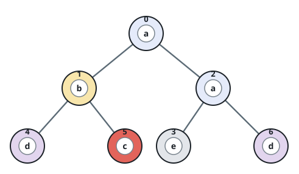
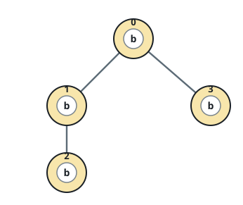
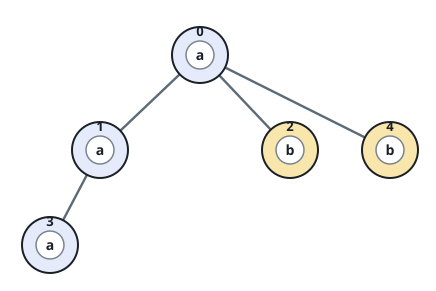

# Label Counts in Each Subtree

## Description

You are given a tree with `n` nodes numbered `0` through `n - 1`, rooted
at node `0` and described by exactly `n - 1` undirected edges. Every node
carries a label — a single lowercase letter — supplied as the string
`labels`, where `labels[i]` belongs to node `i`.

The connections come as `edges`, where `edges[i] = [ai, bi]` means nodes
`ai` and `bi` are joined by an edge.

Build an array `ans` of length `n` such that `ans[i]` counts the nodes in
node `i`'s subtree sharing node `i`'s label. A node's subtree is the node
itself together with every one of its descendants.

### Example 1



```text
Input: n = 7, edges = [[0,1],[0,2],[1,4],[1,5],[2,3],[2,6]], labels = "abaedcd"
Output: [2,1,1,1,1,1,1]
Explanation: Node 0 and node 2 are the only two 'a'-labeled nodes, and 2
sits in 0's subtree, so ans[0] = 2. (A node always lies inside its own
subtree.) Node 1's subtree holds nodes 1, 4, and 5; since 4 and 5 carry
labels other than 'b', ans[1] = 1.
```

### Example 2



```text
Input: n = 4, edges = [[0,1],[1,2],[0,3]], labels = "bbbb"
Output: [4,2,1,1]
Explanation: Every label is 'b'. Node 2 and node 3 head subtrees of just
themselves, node 1's subtree holds nodes 1 and 2, and node 0's subtree
spans the whole tree, so the answers are 1, 1, 2, and 4.
```

### Example 3



```text
Input: n = 5, edges = [[0,1],[0,2],[1,3],[0,4]], labels = "aabab"
Output: [3,2,1,1,1]
```

### Constraints

- `1 <= n <= 10⁵`
- `edges.length == n - 1`
- `edges[i].length == 2`
- `0 <= ai, bi < n`
- `ai != bi`
- `labels.length == n`
- `labels` consists only of lowercase English letters.

## Hints

### Hint 1

Walk the tree so that every node can pass a small summary up to its
parent.

### Hint 2

Let that summary be a 26-entry table of how many times each letter
appears within the node's subtree.
