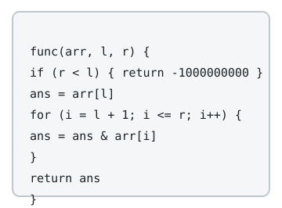

# Closest Subarray AND

## Description

You are given an integer array `arr` and an integer `target`. Define
`func(arr, l, r)` as the bitwise AND of the elements from index `l`
through index `r`, inclusive:

```text
func(arr, l, r) = arr[l] & arr[l + 1] & ... & arr[r]
```



Choose `l` and `r` — each free to be any index satisfying
`0 <= l, r < arr.length` — so that `|func(arr, l, r) - target|` is as
small as possible, and return that smallest possible difference.

### Example 1

```text
Input: arr = [12,9,14], target = 10
Output: 1
Explanation: The one-element subarrays evaluate to 12, 9, and 14, while
every subarray of length 2 or more ANDs down to 8. The nearest value to
the target 10 is 9, one away, so the answer is 1.
```

### Example 2

```text
Input: arr = [14,7,3], target = 6
Output: 0
Explanation: Taking l = 0 and r = 1 gives 14 & 7 = 6, hitting the target
exactly.
```

### Example 3

```text
Input: arr = [8,8,8], target = 3
Output: 5
Explanation: Every call to func returns 8 regardless of l and r, so the
closest any call gets to 3 is a distance of 5.
```

### Constraints

- `1 <= arr.length <= 10⁵`
- `1 <= arr[i] <= 10⁶`
- `0 <= target <= 10⁷`

## Hints

### Hint 1

With the left end fixed, sliding the right end can only switch bits off:
AND never turns a bit on. The value is monotonically non-increasing as
the window widens.

### Hint 2

For each right end, collect the distinct AND-values over all subarrays
that end there. That collection stays small, and the next right end's
collection follows from ANDing one new element with each value in the
current one.
