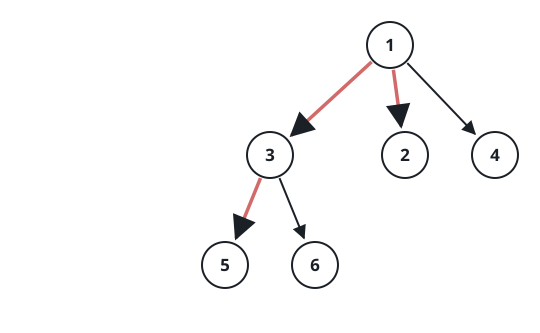
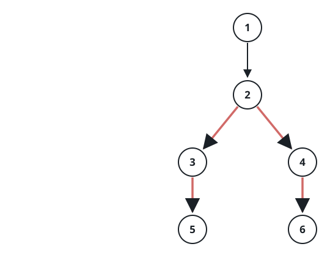

# Longest Path in an N-ary Tree

## Description

Given the `root` of an n-ary tree, return the length of its longest
path.

A path's length is the number of edges between its two endpoints, and
the longest path may or may not pass through the root.

The tree arrives serialized in level order, each group of children
terminated by a `null` marker (the examples show the shape).

### Example 1



```text
Input: root = [1,null,3,2,4,null,5,6]
Output: 3
Explanation: The longest path links 5 → 3 → 1 → 2: three edges, rising
from a leaf under node 3 to the root and back down to a leaf under
node 2.
```

### Example 2



```text
Input: root = [1,null,2,null,3,4,null,5,null,6]
Output: 4
Explanation: The tree is one chain fringed with short branches: 1 → 2,
2 → 3 and 2 → 4, 3 → 5 and 4 → 6. The deepest leaves 5 and 6 join
through their grandparent 2 — four edges that never reach the root.
```

### Example 3


```text
Input: root = [1,null,2,3,4,5,null,null,6,7,null,8,null,9,10,null,null,11,null,12,null,13,null,null,14]
Output: 7
Explanation: The longest path runs 14 → 11 → 7 → 3 → 1 → 4 → 8 → 12,
seven edges from the deepest leaf on one side to a deepest leaf on the
other.
```

### Constraints

- The total number of nodes is in the range `[1, 10⁴]`.
- The depth of the n-ary tree is at most `1000`.

## Hints

### Hint 1

Any longest path bends around exactly one node — its highest point —
with one arm running down into one child's subtree and the other arm
down into a different child's. An arm that came back down the child it
climbed out of would reuse an edge.

### Hint 2

A post-order walk can return each node's height — its longest downward
arm, counted in edges — to its parent. The bend through a node then
totals its two tallest child arms plus the two connecting edges, and
the widest bend anywhere is the answer.
