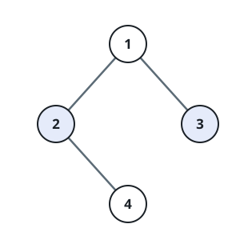
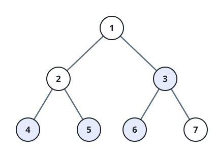

# Leaf Pairs Within Reach

## Description

You are given the `root` of a binary tree and an integer `distance`.
Call a pair of two distinct leaves **within reach** when the shortest
path between them — measured in edges — has length at most `distance`.

Return how many within-reach leaf pairs the tree contains.

### Example 1



```text
Input: root = [1,2,3,null,4], distance = 3
Output: 1
```

The leaves are `3` and `4`; the shortest path between them is 3 edges
long, so this single pair counts.

### Example 2



```text
Input: root = [1,2,3,4,5,6,7], distance = 3
Output: 2
```

The pairs `[4,5]` and `[6,7]` each sit 2 edges apart and count. The pair
`[4,6]` does not: reaching across the root takes 4 edges.

### Example 3

```text
Input: root = [1,2,3,4,5], distance = 3
Output: 3
```

Leaves `4` and `5` are 2 edges apart through node `2`, and each of them
reaches leaf `3` in 3 edges through the root — every pair of leaves
counts.

### Example 4

```text
Input: root = [1,2,3,4,null,null,null,5], distance = 3
Output: 0
```

The two leaves, `4` and `5`, are 4 edges apart, which overshoots the
budget of 3.

### Constraints

- The number of nodes in the tree is in the range `[1, 2¹⁰]`.
- `1 <= Node.val <= 100`
- `1 <= distance <= 10`

## Hints

### Hint 1

Launch a depth-first search from every leaf, and stop as soon as the
walk has used more than `distance` edges.

### Hint 2

Whenever such a walk arrives at another leaf within the budget, one more
pair has been found.

### Hint 3

Each pair is discovered twice this way — once from each endpoint — so
halve the total at the end.
