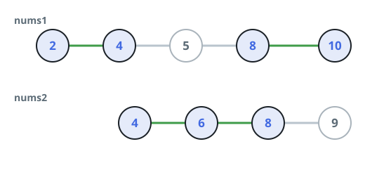

# The Richest Crossing Path

## Description

You are given two arrays of **distinct** integers, `nums1` and `nums2`,
each sorted in strictly increasing order.

A path through them is built like this:

- Pick one of the two arrays and start reading it from its first value.
- Keep walking left to right through whichever array you are currently
  on.
- Every time the value you just read also appears in the other array,
  you may jump across and continue there, starting right after that
  shared value. A shared value is tallied exactly once, no matter which
  array you read it from.

A path's score is the sum of the values it visits. Over all legal
paths, return the greatest score attainable. Because the raw total can
be enormous, report it modulo `10^9 + 7`.

### Example 1



```text
Input: nums1 = [2,4,5,8,10], nums2 = [4,6,8,9]
Output: 30
Explanation: The arrays overlap at 4 and 8. The route
[2,4,6,8,10] — open in nums1, hop to nums2 at 4 to collect 6, hop
back at 8 to finish with 10 — scores 2+4+6+8+10 = 30, beating every
other legal route.
```

### Example 2

```text
Input: nums1 = [5,9,13,20], nums2 = [7,9,12,15,20]
Output: 63
Explanation: The shared values are 9 and 20. Reading nums2 straight
through wins both stretches: 7 outruns nums1's 5 before the first
crossing, and 12+15 outruns nums1's 13 between crossings, giving
7+9+12+15+20 = 63.
```

### Example 3

```text
Input: nums1 = [2,6], nums2 = [3,8,10]
Output: 21
Explanation: The arrays share nothing, so a path can never change
tracks; the answer is simply the larger array total, 3+8+10 = 21.
```

### Constraints

- `1 <= nums1.length, nums2.length <= 10^5`
- `1 <= nums1[i], nums2[i] <= 10^7`
- `nums1` and `nums2` are strictly increasing.

## Hints

### Hint 1

Cut both arrays into stretches at the values they share. Each stretch
is worth whichever of its two readings sums higher, and each shared
value is added once — so advance through both arrays in tandem,
banking stretch sums and merging at every meeting point.
