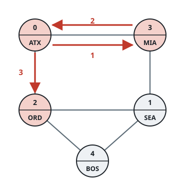
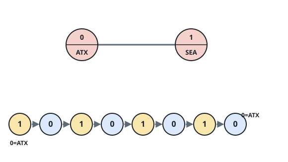
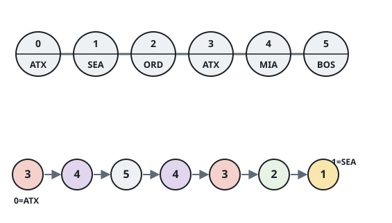

# The Least Mismatched City Walk

## Description

A road network links `n` cities numbered `0` through `n - 1`; each entry
`roads[i] = [a, b]` is a two-way road between cities `a` and `b`. City
`i` carries the three-letter upper-case name `names[i]`, and distinct
cities are allowed to share a name. The network is connected, so every
city can be reached from every other.

You are also given `targetPath`, a sequence of names. Construct a walk
`ans` through the network of the same length: `ans[i]` is a city number,
each consecutive pair `ans[i]`, `ans[i + 1]` must be directly joined by
a road, and the walk should disagree with `targetPath` as rarely as
possible — that is, the number of positions `i` where
`names[ans[i]] != targetPath[i]` must be minimal. Revisiting is
unrestricted: a city may appear many times in `ans`, and traveling out
along a road and immediately back along it is fine, so the same road may
be crossed any number of times.


Return `ans`. When several walks reach the minimum number of mismatches,
any of them is accepted.

### Example 1



```text
Input: n = 5, roads = [[0,2],[0,3],[1,2],[1,3],[1,4],[2,4]],
       names = ["ATX","SEA","ORD","MIA","BOS"], targetPath = ["ATX","MIA","BOS","ORD"]
Output: [0,3,0,2]
Explanation: [0,3,0,2], [0,3,1,2], and [0,2,4,2] all miss on exactly one
position, and nothing achieves zero misses. [0,3,0,2] spells
["ATX","MIA","ATX","ORD"] — a perfect match except at index 2.
```

### Example 2



```text
Input: n = 2, roads = [[0,1]], names = ["ATX","SEA"],
       targetPath = ["AAA","BBB","CCC","DDD","EEE","FFF","GGG","HHH"]
Output: [1,0,1,0,1,0,1,0]
Explanation: Neither city is ever named anything in targetPath, so every
legal walk through these two cities misses at all 8 positions and every
such walk is an accepted answer.
```

### Example 3



```text
Input: n = 6, roads = [[0,1],[1,2],[2,3],[3,4],[4,5]],
       names = ["ATX","SEA","ORD","ATX","MIA","BOS"],
       targetPath = ["ATX","MIA","BOS","MIA","ATX","ORD","SEA"]
Output: [3,4,5,4,3,2,1]
Explanation: [3,4,5,4,3,2,1] spells targetPath exactly — zero misses —
and it is the only walk that manages that.
```

### Constraints

- `2 <= n <= 100`
- `m == roads.length`
- `n - 1 <= m <= n * (n - 1) / 2`
- `0 <= roads[i][0], roads[i][1] <= n - 1`
- `roads[i][0] != roads[i][1]`
- The network is connected, and no pair of cities is joined by more than
  one road.
- `names.length == n`
- Every name in `names` is 3 upper-case English letters.
- `1 <= targetPath.length <= 100`
- Every name in `targetPath` is 3 upper-case English letters.

### Follow up

What would change in your approach if each city could be visited at most
once?

## Hints

### Hint 1

Define `dp[i][c]` as the fewest mismatches achievable by a walk of `i +
1` cities that ends at city `c`, and fill it in one name of
`targetPath` at a time.

### Hint 2

Each row depends only on the one before it: `dp[i][c]` is the minimum
`dp[i - 1][u]` over cities `u` joined to `c` by a road, plus `1` when
`names[c]` differs from `targetPath[i]`.

### Hint 3

After the final row is complete, start from a city that minimizes it and
follow parent pointers backwards to read off one optimal walk.
