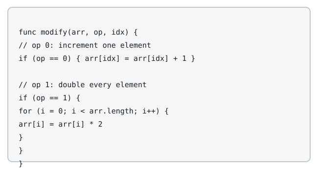

# Building the Target From All Zeros

## Description

You start from an integer array `arr` of the same length as `nums`, with
every entry equal to `0`, and you want to end with `arr` equal to
`nums`. Two moves are available, and you may interleave them however you
like:

- **Bump**: pick one index `i` and raise `arr[i]` by `1`.
- **Double**: every entry of `arr` is multiplied by `2` at once.



Return the smallest possible total number of moves.

The test cases are generated so that the answer fits in a 32-bit signed
integer.

### Example 1

```text
Input: nums = [1,3]
Output: 4
Explanation: Bump index 1: [0, 0] -> [0, 1] (1 move).
Double everything: [0, 1] -> [0, 2] (1 move).
Bump index 1, then index 0: [0, 2] -> [0, 3] -> [1, 3] (2 moves).
Total: 1 + 1 + 2 = 4.
```

### Example 2

```text
Input: nums = [2,4,8]
Output: 6
Explanation: [0,0,0] -> [0,0,1] -> [0,1,1] -> [0,2,2] -> [1,2,2]
-> [2,4,4] -> [2,4,8] — three bumps and three doubles.
```

### Example 3

```text
Input: nums = [0,7,0]
Output: 5
Explanation: Zero entries double for free, so only index 1 matters:
[0,0,0] -> [0,1,0] -> [0,2,0] -> [0,3,0] -> [0,6,0] -> [0,7,0]
— three bumps and two doubles.
```

### Constraints

- `1 <= nums.length <= 10⁵`
- `0 <= nums[i] <= 10⁹`

## Hints

### Hint 1

Run the whole process backwards, from `nums` down toward all zeros.

### Hint 2

Halving is the cheap reverse move, but it is only legal while every
entry is even — so squeeze in as many halvings as parity allows.
