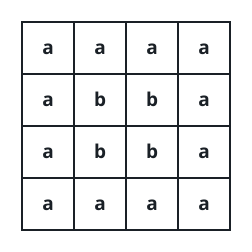
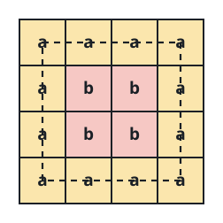
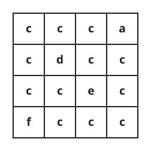
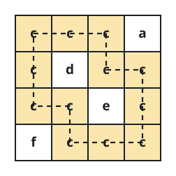
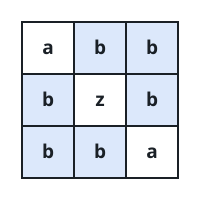

# Letter Loops in a Grid

## Description

A rectangular `grid` is filled with lowercase English letters. From any
cell you may walk to an orthogonal neighbor — above, below, left, or
right — but only while the neighbor carries the same letter as your
current cell. Call the walk a **loop** when it is at least four steps
long and finishes back on its starting cell.

Backtracking is not walking: you may not step straight onto the cell you
just left. The two-step hop `(1,1) -> (1,2) -> (1,1)`, for instance,
merely undoes the first move and closes nothing.

Return `true` when some same-letter walk in `grid` closes into a loop,
and `false` otherwise.

### Example 1





```text
Input: grid = [["a","a","a","a"],["a","b","b","a"],["a","b","b","a"],["a","a","a","a"]]
Output: true
Explanation: The "a" cells form a square ring around the border, and the
four "b" cells close a smaller ring of their own — either suffices.
```

### Example 2





```text
Input: grid = [["c","c","c","a"],["c","d","c","c"],["c","c","e","c"],["f","c","c","c"]]
Output: true
Explanation: The "c" cells wind all the way around the isolated interior
"d" and "e" cells and rejoin themselves, so the grid holds a loop.
```

### Example 3



```text
Input: grid = [["a","b","b"],["b","z","b"],["b","b","a"]]
Output: false
Explanation: The "b" cells break into two short arms that never meet
again, and the "z" together with the corner "a" cells interrupts every
potential ring.
```

### Constraints

- `grid` has between `1` and `500` rows; every row has the same length,
  between `1` and `500` columns.
- Each cell of `grid` contains a lowercase English letter.

## Hints

### Hint 1

Carry the cell you came from along with the walk. Returning to that one
cell is a reversal, not a completed loop.

### Hint 2

Flood each same-letter region with DFS or BFS while marking visited
cells. Reaching a marked cell other than your immediate predecessor
means two routes lead there — the region holds a loop.
