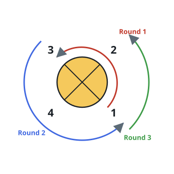

# Busiest Sectors of the Loop

## Description

A loop-shaped course is divided into `n` sectors numbered `1` through `n`
in order, and a checkpoint log `rounds` records where each stage of a
relay ends. There are `m = rounds.length - 1` stages: stage `i` begins at
sector `rounds[i - 1]` and finishes at sector `rounds[i]`.

Travel always proceeds in increasing sector number, circling from sector
`n` back around to sector `1`. Every sector touched during a stage counts
as a visit — the stage's start and end sectors included.

Return, in increasing order, every sector that ties for the most visits.

### Example 1



```text
Input: n = 4, rounds = [1,3,1,2]
Output: [1,2]
Explanation: Starting from sector 1 the visits run:
1 -> 2 -> 3 (end of stage 1) -> 4 -> 1 (end of stage 2) -> 2 (end of
stage 3 and of the relay). Sectors 1 and 2 each collect two visits,
more than anywhere else.
```

### Example 2

```text
Input: n = 5, rounds = [3,5,4,1]
Output: [1,3,4,5]
```

### Example 3

```text
Input: n = 9, rounds = [2,8]
Output: [2,3,4,5,6,7,8]
```

### Constraints

- `2 <= n <= 100`
- `1 <= m <= 100`
- `rounds.length == m + 1`
- `1 <= rounds[i] <= n`
- `rounds[i] != rounds[i + 1]` for `0 <= i < m`

## Hints

### Hint 1

You can simply tally one visit for every sector passed during every
stage and see which tally is highest.

### Hint 2

Or notice what the full relay reduces to: a stretch of complete laps,
which favor no sector, topped up by the single stretch from the first
checkpoint to the last.
