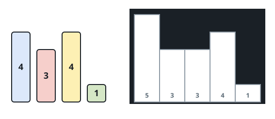
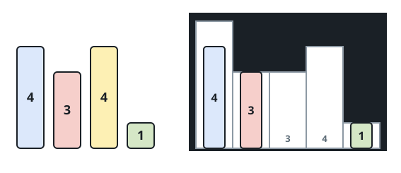

# Fitting Boxes Into Rooms I

## Description

Two arrays of positive integers are given: `boxes`, the heights of a set
of unit-width boxes, and `warehouse`, the heights of `n` rooms in a
storage hall. Rooms are numbered `0` through `n - 1` from left to right,
and `warehouse[i]` (0-indexed) is the height of the `i`th room.

Boxes enter under these rules:

- Boxes are never stacked on top of one another.
- You choose the order in which the boxes are pushed in.
- Every box is pushed into the hall from the left end only.
- A room shorter than a box blocks it: that box — and every box still
  trailing behind it in the push — stops in front of that room and can
  never reach any room beyond it, however tall those farther rooms are.

Return the largest number of boxes that can end up inside the hall.

### Example 1





```text
Input: boxes = [4,3,4,1], warehouse = [5,3,3,4,1]
Output: 3
Explanation: Drop the height-1 box into room 4. Any one of rooms 1, 2,
or 3 (height 3) can take a height-3 box, and room 0 (height 5) takes a
height-4 box. There is no way to fit all four boxes.
```

### Example 2


```text
Input: boxes = [1,2,2,3,4], warehouse = [3,4,1,2]
Output: 3
Explanation: The height-4 box is stuck forever — the very first room is
only height 3, so nothing taller than 3 ever gets past the entrance. The
last two rooms measure 1 and 2, and between them they can hold just the
lone height-1 box. Three boxes is the best possible.
```

### Example 3

```text
Input: boxes = [2,1,5], warehouse = [4,1,6]
Output: 2
Explanation: The middle room of height 1 caps every room after it at
height 1, and the entrance itself is height 4, so the height-5 box has
nowhere to stop. The other two boxes both fit — for instance, height 1
deep in room 2 and height 2 in room 0.
```

### Constraints

- `n == warehouse.length`
- `1 <= boxes.length, warehouse.length <= 10⁵`
- `1 <= boxes[i], warehouse[i] <= 10⁹`

## Hints

### Hint 1

Work the boxes from smallest to largest — the shortest box is the one
most worth trying first.

### Hint 2

A box travelling from the entrance must clear every room on its way, so
the usable height at position `i` is really the smallest room height
seen so far, not `warehouse[i]` itself.
