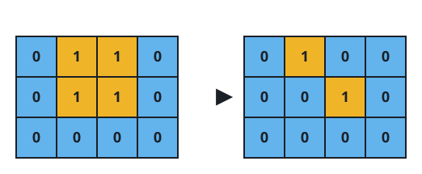
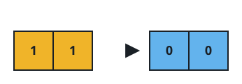

# Breaking the Island Apart in Fewest Days

## Description

A rectangular `grid` marks each cell with `1` for land or `0` for water.
Land cells count as one **island** when they form a maximal group joined
edge to edge — cells that merely touch diagonally stay separate.

The grid is **connected** precisely when exactly one island occupies it.
Every other state — no island at all because everything is water, or two
or more distinct islands — counts as **disconnected**.

Each day, you may flood one land cell of your choosing, turning it into
water. Return the fewest days of flooding needed until the grid becomes
disconnected.

### Example 1



```text
Input: grid = [[0,1,1,0],[0,1,1,0],[0,0,0,0]]
Output: 2
Explanation: The land is one solid 2x2 block; erase any single cell and
the remaining three stay joined. Flooding grid[0][2] and grid[1][1]
leaves two lone land cells — two separate islands — so two days are
needed and one will not do.
```

### Example 2



```text
Input: grid = [[1,1]]
Output: 2
Explanation: With two land cells, removing one still leaves exactly one
island, so a single day cannot disconnect the grid. A second day floods
the last cell, and an all-water grid — zero islands — counts as
disconnected.
```

### Example 3

```text
Input: grid = [[0,1,0],[1,0,1],[0,1,0]]
Output: 0
Explanation: The four land cells touch only at corners, so they are
already four separate islands and the grid is disconnected before any
work is done.
```

### Example 4

```text
Input: grid = [[1,0,0],[1,1,1],[0,0,1]]
Output: 1
Explanation: The land is a dumbbell: a cell on the left, a bridge cell
in the middle, and a cell on the right. Flooding the bridge splits the
land into two islands in a single day.
```

### Constraints

- `grid` has between `1` and `30` rows; every row has the same number of
  columns, also between `1` and `30`.
- Every cell is `0` or `1`.

## Hints

### Hint 1

If the grid is disconnected already, no day is needed at all.

### Hint 2

Otherwise test each land cell: flooding one of them may already break
the island apart.

### Hint 3

If no single flooding works, the answer is two.

### Hint 4

Two days are always enough — the answer never rises above 2.
