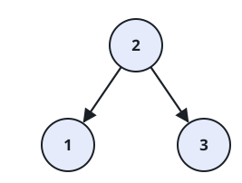
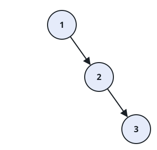

# Insertion Orders That Rebuild the Same Tree

## Description

The array `nums` contains the integers `1` through `n`, each exactly
once. Feed its values into an initially empty binary search tree (BST)
in the order given — each value walks down the tree and settles as a
new leaf, exactly as a plain BST insertion behaves.

Two different orderings can finish with a tree of identical shape and
labels. Count how many orderings _other than the original_ produce the
same BST as `nums` does, and report that count modulo `10^9 + 7`.

### Example 1



```text
Input: nums = [2,1,3]
Output: 1
Explanation: With 2 planted first, 1 becomes its left child and 3 its
right child. The order [2,3,1] reaches the very same tree — 3 still
lands right of the root and 1 left of it, whichever arrives first. No
third ordering works, so exactly 1 other ordering exists.
```

### Example 2


```text
Input: nums = [3,4,5,1,2]
Output: 5
Explanation: Exactly these 5 orderings build the same BST as
[3,4,5,1,2]:
[3,1,2,4,5]
[3,1,4,2,5]
[3,1,4,5,2]
[3,4,1,2,5]
[3,4,1,5,2]
```

### Example 3



```text
Input: nums = [1,2,3]
Output: 0
Explanation: The values arrive already ascending, so each one becomes
the rightmost node and the tree is one right-leaning chain. Any
ordering that rebuilds this chain has to insert 1, then 2, then 3 —
which is the original order alone, leaving zero alternatives.
```

### Constraints

- `1 <= nums.length <= 1000`
- `1 <= nums[i] <= nums.length`
- The values in `nums` are all distinct.

## Hints

### Hint 1

Think divide and conquer: an ordering's first value becomes the root,
and the rest splits into the values smaller than it and the values
larger than it — each keeping its original left-to-right order.

### Hint 2

The two sides are independent. If `x` values must stay ordered among
themselves and `y` values likewise, the number of ways to weave the two
groups into one sequence is the number of ways to choose positions in a
sequence of length `x + y`.
