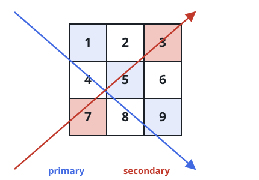

# Summing a Square's Two Diagonals

## Description

You are given a square matrix `mat`. Add up its two diagonals: the main
diagonal running from the top-left corner to the bottom-right corner,
and the anti-diagonal running from the top-right corner to the
bottom-left corner.

When the square's size is odd, the two diagonals share the center
element — count that cell once, not twice. Return the combined total.

### Example 1



```text
Input: mat = [[1,2,3],[4,5,6],[7,8,9]]
Output: 25
Explanation: The total is 1 + 5 + 9 + 3 + 7 = 25; the center cell
mat[1][1] = 5 sits on both diagonals but is counted just once.
```

### Example 2

```text
Input: mat = [[2,4,6,8],[1,3,5,7],[9,8,7,6],[2,4,6,8]]
Output: 43
```

### Example 3

```text
Input: mat = [[4,2],[9,1]]
Output: 16
Explanation: In a 2x2 square all four cells lie on a diagonal:
4 + 1 + 2 + 9 = 16, with no shared center.
```

### Constraints

- `n == mat.length == mat[i].length`
- `1 <= n <= 100`
- `1 <= mat[i][j] <= 100`

## Hints

### Hint 1

The main and anti-diagonals overlap in exactly one cell — the center —
and only when the side length is odd.
