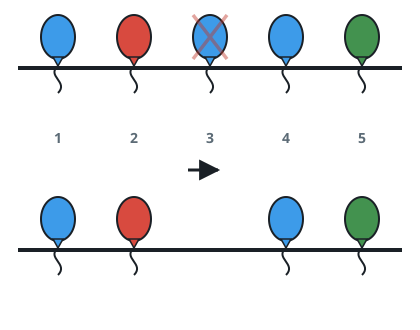
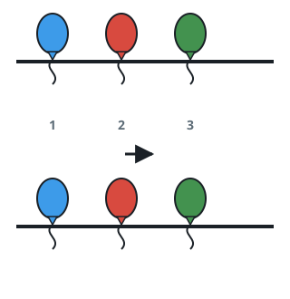
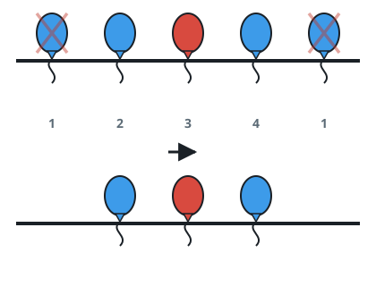

# Cheapest Removals for a Colorful Rope

## Description

A string of `n` balloons hangs on a rope, one balloon per position.
You are given the 0-indexed string `colors`, where `colors[i]` is the
color of balloon `i`, and the 0-indexed array `neededTime`, where
`neededTime[i]` is how many seconds it takes to snip balloon `i` off
the rope.

The rope looks good only when neighboring balloons never repeat a
color. Snip away any balloons you like — each snip costs that
balloon's `neededTime` in seconds — and return the smallest total
number of seconds that leaves no two adjacent balloons with the same
color.

### Example 1

```text
Input: colors = "abaac", neededTime = [1,2,3,4,5]
Output: 3
Explanation: Snipping the middle 'a' at index 2 (3 seconds) breaks up
the adjacent pair of a's, and nothing else needs to go. The cheapest
possible total is 3.
```



### Example 2

```text
Input: colors = "abc", neededTime = [1,2,3]
Output: 0
Explanation: Neighbors already differ everywhere, so no balloon is
snipped and the cost is 0.
```



### Example 3

```text
Input: colors = "aabaa", neededTime = [1,2,3,4,1]
Output: 2
Explanation: The pair of a's at indices 0 and 1 repeats, as does the
pair at indices 3 and 4. Snipping index 0 (1 second) and index 4
(1 second) fixes both runs, for a total of 2.
```



### Constraints

- `n == colors.length == neededTime.length`
- `1 <= n <= 10^5`
- `1 <= neededTime[i] <= 10^4`
- `colors` consists only of lowercase English letters.

## Hints

### Hint 1

For a stretch of consecutive balloons that all share one color, the
rope ends up keeping exactly one of them — think about which one is
cheapest to leave alone.

### Hint 2

Scanning left to right, accumulate both the sum and the maximum of
`neededTime` inside the current same-color stretch; when the color
changes, the stretch's cost is its sum minus its maximum.
