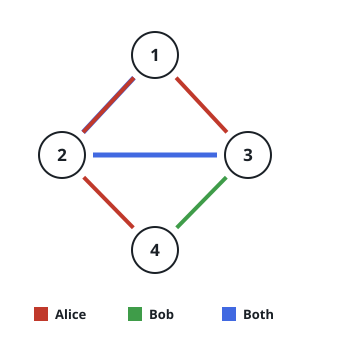
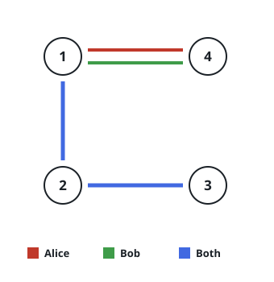
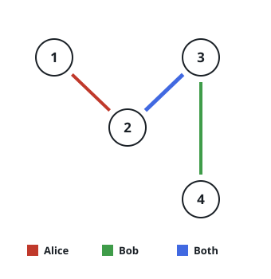

# Prune the Most Edges From a Two-Traveler Graph

## Description

Alice and Bob share one undirected graph on `n` nodes. Its links come in
three kinds:

- **Kind 1** links carry only Alice.
- **Kind 2** links carry only Bob.
- **Kind 3** links carry both of them.

Every link is listed in `edges` as `edges[i] = [kind, u, v]`: a
bidirectional connection of the given `kind` between nodes `u` and `v`.

Prune away as many links as possible while leaving a network that both
travelers can still fully cross. A traveler fully crosses the network
when, starting from any node, they can reach every other node using only
the link kinds they are allowed on.

Return the largest number of links that can be pruned, or `-1` if no
network that both travelers can fully cross can be kept.

### Example 1



```text
Input: n = 4, edges = [[3,1,2],[3,2,3],[1,1,3],[1,2,4],[1,1,2],[2,3,4]]
Output: 2
Explanation: Dropping [1,1,2] and [1,1,3] still leaves both travelers
able to reach every node. Any further drop breaks that, so 2 is the
most that can go.
```

### Example 2



```text
Input: n = 4, edges = [[3,1,2],[3,2,3],[1,1,4],[2,1,4]]
Output: 0
Explanation: Every single link here is load-bearing: cut any one of them
and at least one traveler loses full reach, so nothing can be pruned.
```

### Example 3



```text
Input: n = 4, edges = [[3,2,3],[1,1,2],[2,3,4]]
Output: -1
Explanation: As given, node 4 is unreachable for Alice and node 1 is
unreachable for Bob. Pruning cannot repair either gap, so keeping a
network both travelers can fully cross is impossible.
```

### Constraints

- `1 <= n <= 10⁵`
- `1 <= edges.length <= min(10⁵, 3 * n * (n - 1) / 2)`
- `edges[i].length == 3`
- `1 <= kind <= 3`
- `1 <= u < v <= n`
- No `(kind, u, v)` triple appears twice in `edges`.

## Hints

### Hint 1

Frame the task as constructing the network you keep, rather than picking
which links to delete.

### Hint 2

Fix the final network in your head and inspect only the links one
traveler may use. How connected can that view be, and how many links can
it hold at most?

### Hint 3

Maintain one disjoint set union structure for Alice and a separate one
for Bob.

### Hint 4

Offer the kind-3 links to both structures before touching the
traveler-specific ones, and use the latter only to attach whatever each
traveler still cannot reach.
