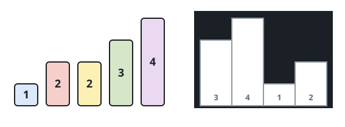

# Fitting Boxes Into Rooms II

## Description

You are given two arrays of positive integers: `boxes`, the heights of
some unit-width boxes, and `warehouse`, the heights of `n` rooms lined up
left to right, where `warehouse[i]` is the height of room `i`.

The boxes are slid into the warehouse under these rules:

- Boxes never stack on top of one another.
- You choose the order in which the boxes are inserted.
- A box may be pushed in from the left end or from the right end.
- A room shorter than an incoming box blocks it: that box — and every box
  pushed behind it in the same motion — stops in front of the room and can
  never get past it, no matter how tall the rooms beyond it are.

Return the largest number of boxes that can end up inside the warehouse.

### Example 1




```text
Input: boxes = [1,2,2,3,4], warehouse = [3,4,1,2]
Output: 4
Explanation: The height-4 box is hopeless — approached from either side,
no room that tall is ever within its reach. The remaining four all find
seats: the height-1 box settles into room 2 (either direction works), a
height-2 box slides into room 3 from the right, the other height-2 box
takes room 1 from the left, and the height-3 box fills room 0. Swapping
the two height-2 boxes between rooms 1 and 3 works just as well.
```

### Example 2


```text
Input: boxes = [3,5,5,2], warehouse = [2,1,3,4,5]
Output: 3
Explanation: Approached from the right, room 4 is the first room a
height-5 box meets, so it is the only room a height-5 box can ever
occupy. Two such boxes but only one usable room means one height-5 box
must stay outside. The height-2 and height-3 boxes both fit elsewhere,
so 3 boxes can be placed in total.
```

### Constraints

- `n == warehouse.length`
- `1 <= boxes.length, warehouse.length <= 10⁵`
- `1 <= boxes[i], warehouse[i] <= 10⁹`

## Hints

### Hint 1

First work out, for every room, how tall a box would need to be to occupy
it when it may arrive from either side.

### Hint 2

Arriving from the left, a box must clear everything up to the room, so
the room is capped by that whole approach's minimum height; arriving from
the right caps it by the other direction's minimum. The room's true
capacity is the looser of the two caps — then matching boxes to
capacities finishes the job.
