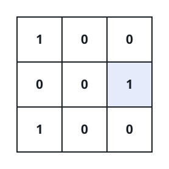
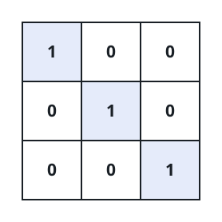

# Lone Ones in a Binary Grid

## Description

You are given an `m x n` binary matrix `mat`. Count the positions that
hold a _lone one_: the `1` at `(i, j)` is a lone one when every other
entry of row `i` and of column `j` is `0` — that is, no other `1` shares
its row or its column. Rows and columns are indexed from 0. Return how
many such positions the matrix holds.

### Example 1



```text
Input: mat = [[1,0,0],[0,0,1],[1,0,0]]
Output: 1
Explanation: The `1` at `(1, 2)` is the grid's only lone one: row 1 and
column 2 contain no other `1`s.
```

### Example 2



```text
Input: mat = [[1,0,0],[0,1,0],[0,0,1]]
Output: 3
Explanation: Every `1` on the diagonal stands alone in both its row and
its column, so `(0, 0)`, `(1, 1)` and `(2, 2)` all count.
```

### Constraints

- `m == mat.length`
- `n == mat[i].length`
- `1 <= m, n <= 100`
- Every entry of `mat` is `0` or `1`.

## Hints

### Hint 1

Tally, for every row and for every column, how many `1`s it contains
before you look at any individual cell.

### Hint 2

A cell holding a `1` then qualifies in constant time: its row tally and
its column tally must both read exactly `1`.
