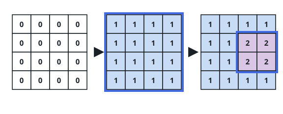
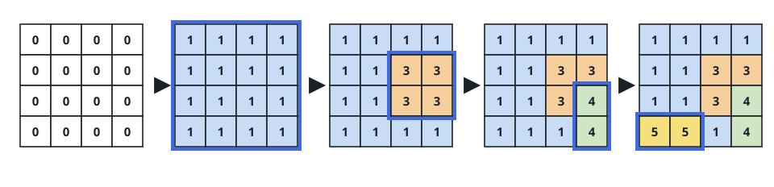

# Stamp Painter II

## Description

A stamp painter fills in a grid through a series of rectangle stamps. On
each move it picks an axis-aligned rectangle and presses one solid color
down over the whole rectangle, replacing every cell inside it, whatever
they showed before. Each color may be pressed at most once — a color that
has already been used can never appear on a later stamp, though its single
stamp may cover a rectangle of any size.

The finished `targetGrid` is handed to you, with `targetGrid[row][col]`
recording the color that ended up at that cell. Work out whether some
order of rectangle stamps could end in exactly this grid.

### Example 1



```text
Input: targetGrid = [[1,1,1,1],[1,2,2,1],[1,2,2,1],[1,1,1,1]]
Output: true
Explanation: Press color 1 over the entire 4x4 grid first, then press
color 2 onto the inner 2x2 block. The second press overwrites whatever it
covers, and the result is exactly this grid.
```

### Example 2



```text
Input: targetGrid = [[1,1,1,1],[1,1,3,3],[1,1,3,4],[5,5,1,4]]
Output: true
Explanation: The presses can go 1, then 5, then 3, then 4: color 1 lays
down the full grid, 5 covers its 1x2 strip in the bottom-left, 3 covers
its own small block, and 4 lands on its two cells last — every stamp
touches only cells that still end up showing its color.
```

### Example 3

```text
Input: targetGrid = [[1,2,2],[2,2,2],[2,2,1]]
Output: false
Explanation: Color 1 sits only in two corners, so the smallest rectangle
covering all of its cells is the whole 3x3 grid — and that rectangle also
contains color-2 cells. The rectangle covering color 2 likewise spans the
entire grid and contains color-1 cells. Whichever color went first, the
other would have to be stamped again afterward, and no color may be
pressed twice.
```

### Constraints

- `m == targetGrid.length`
- `n == targetGrid[i].length`
- `1 <= m, n <= 60`
- `1 <= targetGrid[row][col] <= 60`

## Hints

### Hint 1

Reason about the process backwards: looking at the finished grid, what
would the final stamp have to look like?
