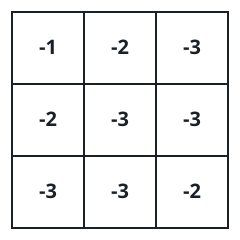
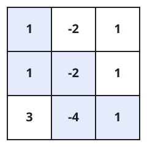
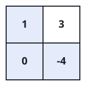

# Best Path Product in a Grid

## Description

You are given an `m x n` matrix `grid`. A walk starts on the top-left
cell `(0, 0)` and repeatedly steps either one cell right or one cell
down, finishing on the bottom-right cell `(m - 1, n - 1)`. Each visited
cell contributes its integer to a running product.

Over all possible walks, pick the one whose product of visited values is
the greatest while still being non-negative, and return that product
modulo `10^9 + 7`. When no walk at all manages a non-negative product,
return `-1`. Note that choosing the best product happens on the true
values — the modulo is applied only at the very end.

### Example 1



```text
Input: grid = [[-1,-2,-3],[-2,-3,-3],[-3,-3,-2]]
Output: -1
Explanation: Every walk collects five negative numbers — one per row
step and column step — so its product is always negative, and no
non-negative product exists.
```

### Example 2



```text
Input: grid = [[1,-2,1],[1,-2,1],[3,-4,1]]
Output: 8
Explanation: The walk passing through both negative cells earns
1 * 1 * -2 * -4 * 1 = 8, and no walk beats it.
```

### Example 3



```text
Input: grid = [[1,3],[0,-4]]
Output: 0
Explanation: The walk that steps through the zero reaches the product
1 * 0 * -4 = 0, the best non-negative product on offer.
```

### Constraints

- `m == grid.length`
- `n == grid[i].length`
- `1 <= m, n <= 15`
- `-4 <= grid[i][j] <= 4`

## Hints

### Hint 1

Carry a dynamic-programming table per cell that stores both the largest
and the smallest product achievable on arrival — negatives flip sign, so
the current minimum may become the future maximum.
