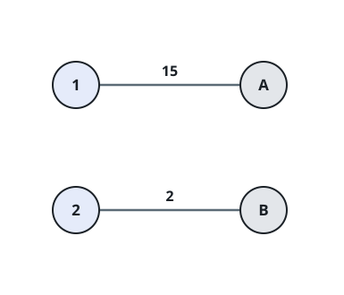
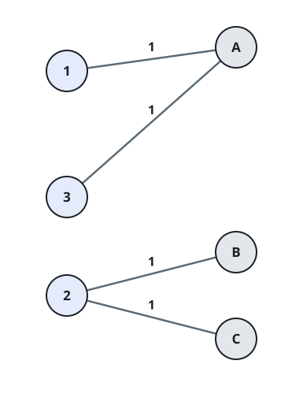

# Cheapest Cross-Links for Two Point Groups

## Description

Two groups of points face each other — picture the first group as a left
column of `size1` points and the second group as a right column of
`size2` points. A `size1 x size2` matrix `cost` prices every possible
link: paying `cost[i][j]` runs one direct link between first-group point
`i` and second-group point `j`.

The two groups count as linked once no point is left out — every point
on the left must hold at least one link to the right side, and every
point on the right at least one link back to the left. A point may hold
any number of links, so nothing stops one busy point from serving
several partners on the far side.

Return the smallest total price over all ways to link the two groups.

### Example 1



```text
Input: cost = [[15,96],[36,2]]
Output: 17
Explanation: Join left point 0 to right point 0 for 15 and left point 1
to right point 1 for 2. Every point on both sides now holds a link, and
the total price is 17.
```

### Example 2



```text
Input: cost = [[1,3,5],[4,1,1],[1,5,3]]
Output: 4
Explanation: Buy four price-1 links: left 0 to right 0, left 1 to right
1, left 1 to right 2, and left 2 to right 0. Left point 1 ends up
carrying two links, which is fine — a point's link count is uncapped —
and nobody on either side is left unconnected. The total is 4.
```

### Example 3

```text
Input: cost = [[6,2,9],[3,8,1],[7,4,5],[1,9,3]]
Output: 8
Explanation: Link left 0 to right 1 (price 2), left 1 to right 2 (price
1), left 2 to right 1 (price 4), and left 3 to right 0 (price 1). All
four left points and all three right points are covered, for a total of
8.
```

### Constraints

- `size1 == cost.length`
- `size2 == cost[i].length`
- `1 <= size1, size2 <= 12`
- `0 <= cost[i][j] <= 100`

## Hints

### Hint 1

Walk the first group's points one at a time. After a few have been
handled, everything about the earlier choices collapses into a single
fact: which second-group points have already picked up a link.

### Hint 2

Search over states (first-group points placed, set of second-group
points already reached) with the reached set packed into a bitmask. Once
the last first-group point is placed, any second-group point that never
got a link can still be attached to whichever first-group point reaches
it most cheaply — link counts are uncapped, so reuse is free.
