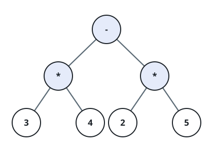
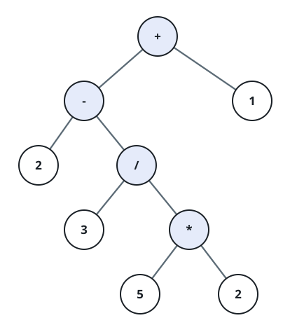
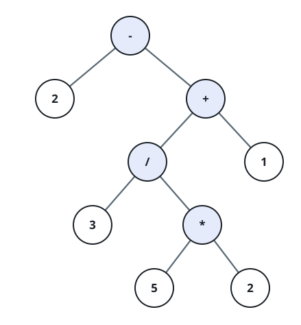
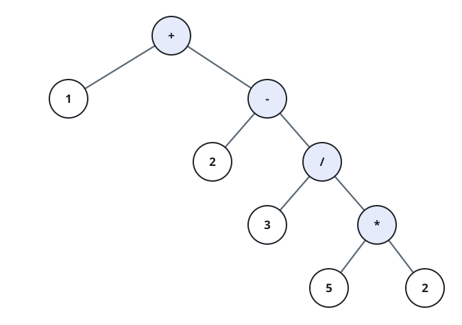

# Value of an Infix Expression

## Description

An infix expression strings together single-digit operands with the
binary operators `+`, `-`, `*`, `/`, using parentheses `(` and `)` where
grouping is needed. The standard reading order decides how it
evaluates: a parenthesized group is resolved first, `*` and `/` bind
tighter than `+` and `-`, and operators on the same level apply in the
order they appear, left to right. Division drops the fractional part
toward zero, so `7 / 2` is `3` while `0 - 7 / 2` is `-3`.

An expression like this can be drawn as a binary expression tree: every
leaf holds a digit, every branching node holds one operator and the two
sub-expressions it combines hang off it as left and right subtrees, and
reading the leaves in order reproduces the original expression. What
this problem wants is the number such a tree evaluates to, not the tree
itself — a judge checked against plain values cannot compare hand-built
node objects. So parse `s` under the ordering rules above (erecting
actual tree nodes is an implementation choice; any evaluation that
honors the same precedence is equivalent) and return the single integer
it comes to.

### Example 1



```text
Input: s = "3*4-2*5"
Output: 2
Explanation: The multiplications settle first — 3*4 is 12 and 2*5 is
10 — leaving 12 - 10 = 2.
```

### Example 2







```text
Input: s = "2-3/(5*2)+1"
Output: 3
Explanation: The parenthesized 5*2 comes down to 10, then 3 / 10
truncates to 0, and the whole thing is 2 - 0 + 1 = 3.
```

### Example 3

```text
Input: s = "0-8/3*2"
Output: -4
Explanation: Multiplication and division share a level and run left to
right: 8 / 3 truncates to 2, then 2 * 2 is 4, so the value is 0 - 4 =
-4.
```

### Constraints

- `1 <= s.length <= 100`
- `s` consists of the digits `0`-`9`, the characters `(`, `)`, `+`,
  `-`, `*`, and `/`.
- Each operand in `s` is exactly one digit.
- `s` is guaranteed to be a valid expression.
- Division always truncates toward zero, and `s` never divides by zero.
- Every intermediate value and the final result fit in a signed 64-bit
  integer.

## Hints

### Hint 1

Give each precedence level its own step: an expression is a chain of
terms joined by `+` and `-`, a term is a chain of factors joined by
`*` and `/`, and a factor is one digit or a whole parenthesized
expression.

### Hint 2

Convert to postfix and build the tree from that before evaluating it —
or skip the intermediate shape entirely and fold each value the moment
its operator is read.
