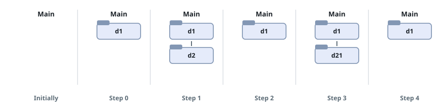
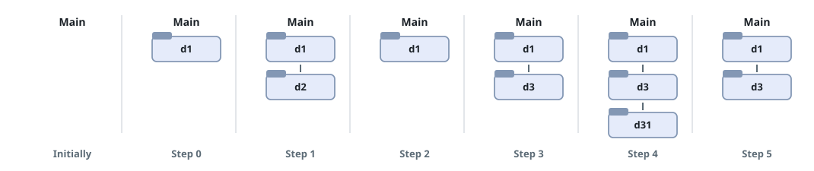

# Steps Back to the Main Folder

## Description

A crawler's change-folder history arrives as a list of log entries,
replayed in order starting from the main folder. Each entry is one of
three moves:

- `"../"` — step out to the parent of the current folder; requesting a
  parent while already in the main folder changes nothing.
- `"./"` — stay where you are.
- `"x/"` — step down into the child folder named `x`, which is
  guaranteed to exist.

You are given `logs`, where `logs[i]` is the move performed at step `i`.
After the whole list has been replayed, count the `"../"` moves needed
to climb back up to the main folder and return that count.

### Example 1



```text
Input: logs = ["d1/","d2/","../","d21/","./"]
Output: 2
Explanation: The replay leaves the crawler inside d21, two levels below
the main folder, so two parent moves bring it back.
```

### Example 2



```text
Input: logs = ["d1/","d2/","./","d3/","../","d31/"]
Output: 3
```

### Example 3

```text
Input: logs = ["../","x/","../","../","y/"]
Output: 1
Explanation: The opening "../" lands while already in the main folder
and does nothing; after dipping into x and climbing back out twice, the
final "y/" sits one level down, so a single move returns to the main
folder.
```

### Constraints

- `1 <= logs.length <= 10^3`
- `2 <= logs[i].length <= 10`
- Each entry uses lowercase English letters, digits, `'.'`, and `'/'`,
  in one of the three formats above.
- Folder names are made of lowercase English letters and digits.

## Hints

### Hint 1

No folder names need to be remembered — one depth counter is enough:
add one on a descent, subtract one on `"../"` but never below zero, and
ignore `"./"`. Whatever the counter holds at the end is the answer.
