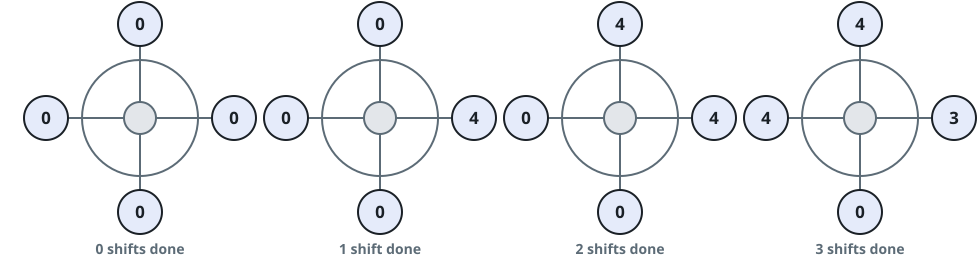

# Rotations to Peak Gondola Profit

## Description

The wheel you run carries its riders in four gondolas, each with room
for at most four people. Turning the wheel one notch costs
`runningCost` dollars. Riders pay `boardingCost` dollars each at the
moment they climb into the gondola sitting at the ground, and they step
off in that same spot one full revolution later.

Arrivals are described by `customers`: `customers[i]` is how many new
riders show up just before the wheel's `i`-th rotation, counting
rotations from 0. Every rotation first fills the ground gondola with up
to four riders from the queue; anyone who does not fit waits for a
later rotation, and no one is made to wait while a seat is still open.

Once every entry of `customers` has arrived, the queue may still hold
riders, and they all must be carried — the wheel keeps turning, each
extra rotation costing `runningCost` and boarding up to four more
riders, until nobody is left waiting.

After each rotation, the running profit is everything collected in
boarding fees so far minus everything paid in rotation costs so far.
Return the number of rotations performed when that running profit first
hits its highest level; if several rotation counts reach the same
maximum, return the smallest. You may shut the wheel down the moment
the peak is reached, and the rotations needed purely to set any
remaining riders down afterwards cost nothing. If the running profit
never climbs above zero, return `-1`.

### Example 1



```text
Input: customers = [8,3], boardingCost = 5, runningCost = 6
Output: 3
Explanation: Rotation 1 seats four of the eight arrivals (profit
4*5 - 1*6 = 14) and leaves four queued. Rotation 2 seats the four
waiting riders while three more show up (8*5 - 2*6 = 28). Rotation 3
carries the final three (11*5 - 3*6 = 37). The profit never climbs
higher, so the answer is 3.
```

### Example 2

```text
Input: customers = [12,4], boardingCost = 6, runningCost = 5
Output: 4
Explanation: Rotation 1 seats 4 of the 12 arrivals (profit 4*6 - 1*5 =
19); rotation 2 seats four more while the extra 4 arrive (8*6 - 2*5 =
38); rotations 3 and 4 drain the queue (12*6 - 3*5 = 57, then 16*6 -
4*5 = 76). The peak lands on rotation 4, exactly when the last rider
boards.
```

### Example 3

```text
Input: customers = [4,4,4], boardingCost = 1, runningCost = 50
Output: -1
Explanation: Every rotation fills a whole gondola, but each one costs
50 dollars while collecting only 4, so the running profit stays below
zero at every rotation count and the answer is -1.
```

### Constraints

- `n == customers.length`
- `1 <= n <= 10^5`
- `0 <= customers[i] <= 50`
- `1 <= boardingCost, runningCost <= 100`

## Hints

### Hint 1

Advance the wheel one rotation at a time while carrying just two
numbers: how many riders are queued and how much profit has piled up.
New arrivals appear only while `customers` still has entries left.

### Hint 2

No entry ever delivers more than 50 riders, so the queue empties within
roughly `50 / 4 * n` rotations all told — plain simulation finishes
long before any limit matters.
