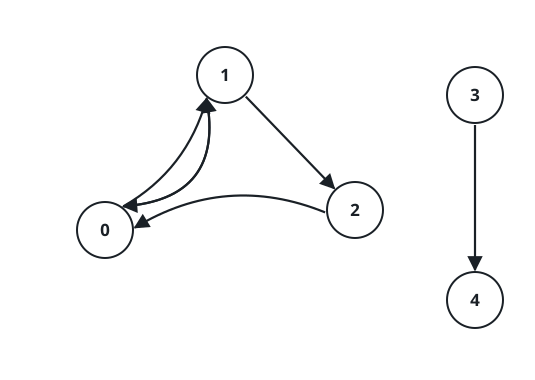

# Largest Balanced Transfer Set

## Description

A company has `n` offices numbered `0` to `n - 1`. Headcounts are frozen:
whatever happens during a reorganization, every office must end it staffed
exactly as it started.

Employees who want to relocate file requests, collected in the array
`requests`, where `requests[i] = [from_i, to_i]` asks for a move from office
`from_i` to office `to_i`.

You grant requests in batches. Every employee in a batch relocates in the
same instant, so cyclical moves are fine; the one hard rule is that each
office must take in exactly as many employees as it gives up, leaving every
headcount unchanged.

Return the largest possible number of requests in a single grantable batch.

### Example 1



```text
Input: n = 5, requests = [[0,1],[1,0],[0,1],[1,2],[2,0],[3,4]]
Output: 5
Explanation: Grant everything except [3,4]. Office 0 sends two employees
(the two [0,1] requests) and receives two ([1,0] and [2,0]). Office 1 sends
two ([1,0] and [1,2]) and receives two (the two [0,1] requests). Office 2
swaps its one outbound employee for the one arriving from office 1. Every
office holds steady, so all 5 of those requests fit in one batch.
```

### Example 2


```text
Input: n = 3, requests = [[0,0],[1,2],[2,1]]
Output: 3
Explanation: The request [0,0] is a request to stay put, which disturbs no
headcount at all. The other two employees trade offices with each other.
Nothing breaks balance, so all 3 requests can be granted together.
```

### Example 3

```text
Input: n = 4, requests = [[0,1],[1,0],[2,3],[3,2],[1,2]]
Output: 4
Explanation: The two independent swaps — offices 0 and 1 trading employees,
and offices 2 and 3 doing the same — balance on their own, so their four
requests form a valid batch. The leftover request [1,2] would pull one extra
employee out of office 1 with nobody arriving to fill the seat, and the only
five-request batch is the whole list, so 4 is the best achievable.
```

### Constraints

- `1 <= n <= 20`
- `1 <= requests.length <= 16`
- `requests[i].length == 2`
- `0 <= from_i, to_i < n`

## Hints

### Hint 1

The request list is tiny — at most 16 entries — which makes trying every
conceivable batch a perfectly reasonable plan.

### Hint 2

A batch is grantable exactly when, office by office, the number of outbound
moves equals the number of inbound moves. For each candidate batch, keep a
running net balance per office and check that it ends at zero everywhere.
