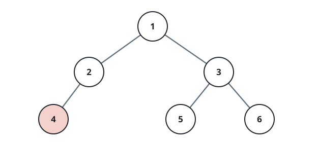
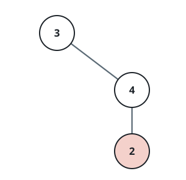

# First Right Neighbor

## Description

You are given the `root` of a binary tree and a value `u` that belongs to
one of its nodes. Scan each level of the tree from left to right, and
report the very next node that follows `u` on its own level. If `u` sits
at the end of its level with nothing after it, report that no such node
exists.

Because nodes travel between your code and the judge as data rather than
object references, the handshake works by value. The tree arrives as a
level-order array, and since every node's value in the tree is unique,
`u` pinpoints exactly one node. The answer travels back the same way: as
the level-order array of the answering node's subtree. When there is no
node to `u`'s right on its level, the answer is the empty array `[]`,
standing in for `null`.

### Example 1



```text
Input: root = [1,2,3,null,4,5,6], u = 4
Output: [5]
Explanation: Node 4 hangs on the tree's third row next to nodes 5 and 6.
Walking that row left to right, node 5 is the first one encountered after
node 4, so the answer is the subtree rooted at 5.
```

### Example 2



```text
Input: root = [3,null,4,2], u = 2
Output: []
Explanation: Node 2 has its level all to itself. With nothing to its
right, there is no right neighbor, and the answer is null, written as [].
```

### Constraints

- The tree holds between `1` and `10⁵` nodes.
- Node values lie in the range `[1, 10⁵]`.
- No two nodes in the tree share a value.
- `u` is guaranteed to be the value of some node under `root`.

## Hints

### Hint 1

Walk the tree breadth-first, one level at a time, always enqueuing the
left child ahead of the right child.

### Hint 2

While scanning, remember the moment the walk reaches the node whose value
is `u`.

### Hint 3

Whatever node the walk reaches next — if the level still has one — is
exactly the right neighbor being asked for.

### Hint 4

If `u` is the final node of its level, or the walk moves on to the next
level without visiting anything further, then no right neighbor exists.
