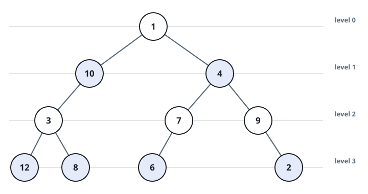
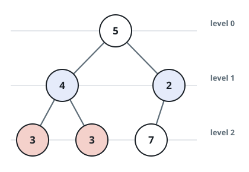
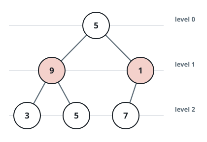

# Parity-Ordered Tree

## Description

Call a binary tree parity-ordered when every level obeys a strict
alternating discipline. Levels are numbered from the root outward: the
root by itself is level `0`, its children form level `1`, and so on down
the tree.

On a level whose index is even, every value must be odd, and reading the
level left to right the values must climb strictly.

On a level whose index is odd, the roles swap: every value must be even,
and the values must fall strictly from left to right.

Given the `root` of a binary tree, report whether the whole tree is
parity-ordered.

### Example 1



```text
Input: root = [1,10,4,3,null,7,9,12,8,6,null,null,2]
Output: true
Explanation: Laid out level by level the tree reads [1], [10,4], [3,7,9],
[12,8,6,2]. Both even-indexed levels carry odd values climbing strictly,
and both odd-indexed levels carry even values falling strictly, so the
tree qualifies.
```

### Example 2



```text
Input: root = [5,4,2,3,3,7]
Output: false
Explanation: Level 2 holds [3,3,7]. The parities are right, but an
even-indexed level must climb strictly and the repeated 3 breaks that
staircase, so the tree does not qualify.
```

### Example 3



```text
Input: root = [5,9,1,3,5,7]
Output: false
Explanation: Level 1 has an odd index, so everything on it must be even;
the level actually reads [9,1], two odd numbers, which disqualifies the
tree at once.
```

### Constraints

- The tree contains between `1` and `10⁵` nodes.
- Every node value lies in the range `[1, 10⁶]`.

## Hints

### Hint 1

A breadth-first traversal hands you the levels in order. While peeling off
each level, watch the level index and compare every value with the one
before it on that same level.
