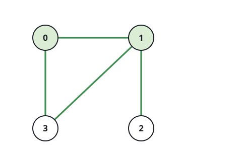
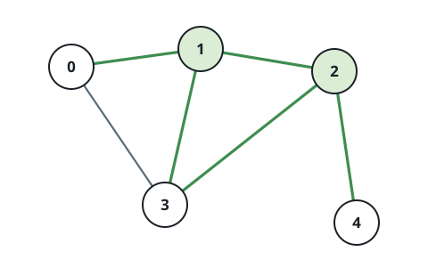

# Busiest Pair Of Hubs

## Description

A road network links `n` cities numbered `0` through `n - 1`, and each
entry `roads[i] = [ai, bi]` describes one bidirectional road joining
cities `ai` and `bi`.

For two **distinct** cities, define their joint tally: the number of
roads that touch either city of the pair, where a road joining the two
cities directly is counted just once.

The network's busiest pair is the pair of distinct cities whose joint
tally is largest. Given `n` and `roads`, return that largest tally.

### Example 1



```text
Input: n = 4, roads = [[0,1],[0,3],[1,2],[1,3]]
Output: 4
Explanation: Cities 0 and 1 together touch four roads; the road running
between them is counted once, not twice.
```

### Example 2



```text
Input: n = 5, roads = [[0,1],[0,3],[1,2],[1,3],[2,3],[2,4]]
Output: 5
Explanation: Five of the roads touch city 1 or city 2.
```

### Example 3

```text
Input: n = 6, roads = [[0,2],[2,5],[2,3],[4,1],[4,5],[4,0]]
Output: 6
Explanation: Three roads meet at city 2 and three at city 4, and no road
runs directly between them, so together the pair touches all six roads.
```

### Constraints

- `2 <= n <= 100`
- `0 <= roads.length <= n * (n - 1) / 2`
- Every entry of `roads` is a pair `[ai, bi]` with
  `0 <= ai, bi <= n - 1` and `ai != bi`.
- No two cities are joined by more than one road.

## Hints

### Hint 1

At this size, simply visiting every pair of distinct cities and scoring
it is affordable.

### Hint 2

A pair's score is its two degrees added together, with one possible
correction: a road joining the pair outright would otherwise be counted
twice.

### Hint 3

Keep the roads in a set of canonical pairs so that correction's
membership test costs constant time.
