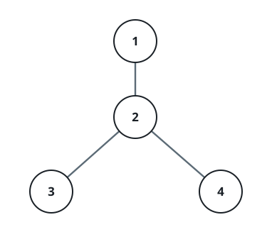

# Subtree Census by Diameter

## Description

There are `n` cities labeled `1` through `n` and `n - 1` bidirectional
roads given as `edges`, where `edges[i] = [ui, vi]` joins cities `ui`
and `vi`. The network is a tree, so exactly one route links any two
cities.

Call a set of cities a **subtree** when every member of the set can
reach every other member while traveling only on roads whose two
endpoints also belong to the set. Two subtrees count as different as
soon as one contains a city the other lacks. A single city by itself
is a subtree too, although it offers no pair of cities to measure.

A subtree's **diameter** is the largest number of roads appearing on a
route between two of its cities. For each `d` from `1` to `n - 1`,
count the subtrees whose diameter equals `d`, and return the counts as
an array `ans` of length `n - 1` where `ans[d - 1]` holds the count
for `d`.

### Example 1



```text
Input: n = 4, edges = [[1,2],[2,3],[2,4]]
Output: [3,4,0]
Explanation: City 2 is the hub. The pair-shaped subtrees {1,2},
{2,3} and {2,4} all have diameter 1, and the four subtrees
{1,2,3}, {1,2,4}, {2,3,4} and {1,2,3,4} all have diameter 2.
Nothing reaches diameter 3.
```

### Example 2

```text
Input: n = 4, edges = [[1,2],[2,3],[3,4]]
Output: [3,2,1]
Explanation: The chain 1-2-3-4 offers three adjacent pairs
({1,2}, {2,3}, {3,4}) with diameter 1, two length-three runs
({1,2,3} and {2,3,4}) with diameter 2, and the whole chain with
diameter 3.
```

### Example 3

```text
Input: n = 5, edges = [[1,2],[1,3],[1,4],[1,5]]
Output: [4,11,0,0]
Explanation: City 1 is the hub. Pairing the hub with exactly one of
its four leaves gives diameter 1, which happens 4 times; pairing it
with two or more leaves gives diameter 2, which happens
6 + 4 + 1 = 11 times.
```

### Constraints

- `2 <= n <= 15`
- `edges.length == n - 1`
- `edges[i].length == 2`
- `1 <= ui, vi <= n`
- All pairs `(ui, vi)` are distinct.

## Hints

### Hint 1

With `n` at most 15, every one of the `2^n` city sets can be tried
directly. The real work per set is deciding cheaply whether the set
hangs together.

### Hint 2

Start from any city the set contains and walk only along roads whose
two ends are both in the set. The set is a genuine subtree precisely
when this walk manages to touch every one of its cities.

### Hint 3

The diameter does not need an all-pairs comparison. Walk from an
arbitrary member to the farthest member reachable inside the set,
then walk a second time starting from that farthest member — the
distance covered by the second walk is the set's diameter.
