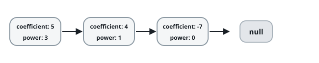
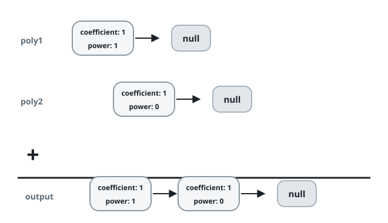

# Adding Polynomial Term Lists

## Description

A polynomial is a sum of terms, where every term carries an integer
**coefficient** and a non-negative integer **power** — for example,
`5x³ + 4x - 7`. Polynomials come in **standard form**: the terms are
ordered by strictly descending power, no two terms share a power, and
terms whose coefficient is `0` are omitted rather than stored.

Each polynomial is handed over as a list of `[power, coefficient]`
pairs, one pair per term, already in standard-form order. Add `poly1`
and `poly2` and return the sum in exactly the same shape — a list of
`[power, coefficient]` pairs sorted by strictly descending power, with
any power whose combined coefficient cancels to `0` left out entirely.



### Example 1



```text
Input: poly1 = [[1,1]], poly2 = [[0,1]]
Output: [[1,1],[0,1]]
Explanation: poly1 is the single term x^1 (in other words, x), and
poly2 is the constant term 1. Their sum is x + 1.
```

### Example 2

```text
Input: poly1 = [[4,3],[1,-5]], poly2 = [[4,-1],[0,2]]
Output: [[4,2],[1,-5],[0,2]]
Explanation: poly1 = 3x^4 - 5x and poly2 = -x^4 + 2. The leading
coefficients combine into 3 + (-1) = 2, giving 2x^4 - 5x + 2.
```

### Example 3

```text
Input: poly1 = [[5,7],[3,-2]], poly2 = [[3,2]]
Output: [[5,7]]
Explanation: The -2x^2 term of poly1 and the 2x^2 term of poly2 cancel
each other, so only 7x^5 survives.
```

### Constraints

- `0 <= poly1.length, poly2.length <= 10⁴`
- `-10⁹ <= coefficient <= 10⁹`, and a stored term's coefficient is
  never `0`
- `0 <= power <= 10⁹`
- inside each of `poly1` and `poly2`, the powers drop strictly from one
  pair to the next

## Hints

### Hint 1

Keep one index into each list and always advance the side whose current
power is larger — that term can never be matched by the other list.

### Hint 2

When the two current powers agree, emit that power with the sum of the
two coefficients, but only when the sum is not `0`.

### Hint 3

After one list runs out, the remainder of the other can be copied over
as-is, because it is already sorted.
