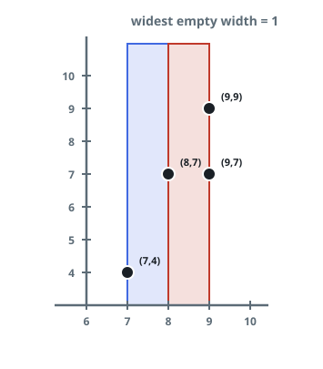

# Widest Empty Vertical Band

## Description

You are given `n` points on a two-dimensional plane, where
`points[i] = [xi, yi]`. A vertical band is a strip of some fixed width
that runs straight up and down — it extends infinitely along the
y-axis. Find the widest vertical band that contains no point strictly
inside it, and return that width.

Points sitting exactly on a band's edges do not count as being inside
it.

### Example 1



```text
Input: points = [[8,7],[9,9],[7,4],[9,7]]
Output: 1
Explanation: The x-coordinates in sorted order are 7, 8, 9, 9. The
widest empty band has width 1 — for instance between x = 7 and
x = 8, or between x = 8 and x = 9.
```

### Example 2

```text
Input: points = [[12,0],[3,9],[3,4],[7,2]]
Output: 5
Explanation: The x-coordinates in sorted order are 3, 3, 7, 12. The
widest empty band stretches from x = 7 to x = 12, a width of 5.
```

### Example 3

```text
Input: points = [[5,5],[5,1],[2,9],[2,2]]
Output: 3
Explanation: Several points share an x-coordinate, but stacked points
never widen the band: the widest empty strip runs from x = 2 to x = 5.
```

### Constraints

- `n == points.length`
- `2 <= n <= 10⁵`
- `points[i].length == 2`
- `0 <= xi, yi <= 10⁹`

## Hints

### Hint 1

Sort the points — but by which coordinate?

### Hint 2

The y-coordinates turn out to be irrelevant: the band spans every
height, so only a point's x-coordinate can land inside it.
