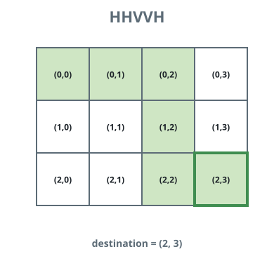

# Kth Ranked Route

## Description

A traveler stands on cell `(0, 0)` of a grid and must arrive at cell
`destination = [row, column]`, moving one cell per step and only ever
right or down. Each route is written as an instruction string whose
characters are

- `'H'` — step one cell to the right, or
- `'V'` — step one cell down.

A string reaches `destination` precisely when it holds exactly `column`
`'H'` characters and exactly `row` `'V'` characters. With
`destination = [2, 3]`, for instance, `"HHHVV"` and `"HVHVH"` are both
legal routes.

Sort every legal string lexicographically, with `'H'` treated as the
smaller letter, and return the one sitting at rank `k`, counting from 1.

### Example 1


```text
Input: destination = [2, 3], k = 1
Output: "HHHVV"
Explanation: The instructions reaching (2, 3), read in lexicographic
order, are:
["HHHVV", "HHVHV", "HHVVH", "HVHHV", "HVHVH", "HVVHH", "VHHHV", "VHHVH",
"VHVHH", "VVHHH"]. Rank 1 belongs to "HHHVV".
```

### Example 2


```text
Input: destination = [2, 3], k = 2
Output: "HHVHV"
Explanation: In that same ordering, the instruction at rank 2 is
"HHVHV".
```

### Example 3



```text
Input: destination = [2, 3], k = 3
Output: "HHVVH"
Explanation: In that same ordering, the instruction at rank 3 is
"HHVVH".
```

### Constraints

- `destination.length == 2`
- `1 <= row, column <= 15`
- `1 <= k <= nCr(row + column, row)`, where `nCr(a, b)` is the number
  of ways to choose `b` items from `a`.

## Hints

### Hint 1

The number of instruction strings that land on `(row, column)` is
`nCr(row + column, row)`.

### Hint 2

Decide the string letter by letter. Before committing a letter, count
how many legal completions would begin with `'H'` and weigh that count
against the rank you still owe.
