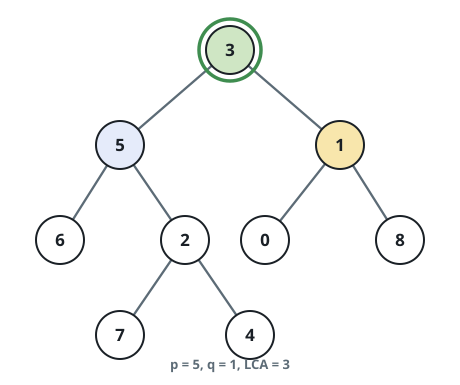
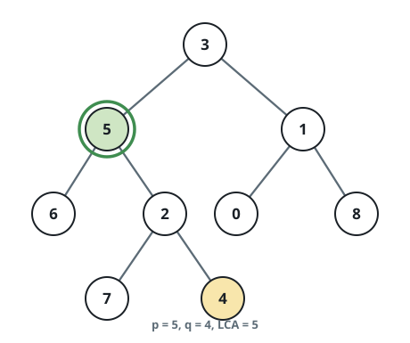
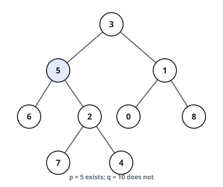

# Nearest Shared Ancestor of a Binary Tree II

## Description

You are given the `root` of a binary tree together with two values `p`
and `q`. Report the nearest shared ancestor — the lowest node that has
both target nodes as descendants, where every node counts as its own
descendant.

The twist relative to the classic version: neither `p` nor `q` is
guaranteed to name an actual node. If either value labels no node in
the tree, the answer is `null`.

The tree crosses the wire as a level-order array and node objects
cannot be handed to your function directly, so the judge matches `p`
and `q` **by value** — every node value in the tree is unique. The
answer also crosses the wire as a level-order array: return the whole
subtree hanging below the shared ancestor (not merely its value), or an
empty array `[]` when no ancestor exists.

### Example 1



```text
Input: root = [3,5,1,6,2,0,8,null,null,7,4], p = 5, q = 1
Output: [3,5,1,6,2,0,8,null,null,7,4]
Explanation: The nodes valued 5 and 1 share the node valued 3 as their
nearest ancestor — the root itself — so the serialized output is the
entire tree.
```

### Example 2



```text
Input: root = [3,5,1,6,2,0,8,null,null,7,4], p = 5, q = 4
Output: [5,6,2,null,null,7,4]
Explanation: The node valued 5 is an ancestor of the node valued 4, and
a node is its own ancestor, so 5 is the answer; the output is the
subtree rooted at 5.
```

### Example 3



```text
Input: root = [3,5,1,6,2,0,8,null,null,7,4], p = 5, q = 10
Output: []
Explanation: Nothing in the tree carries the value 10, so the answer is
null.
```

### Constraints

- The tree holds between `1` and `10⁴` nodes.
- `-10⁹ <= Node.val <= 10⁹`
- Every node value in the tree is unique.
- `p != q`

### Follow up

Can you locate the shared ancestor in a single traversal, with no extra
pass just to confirm that both values exist?

## Hints

### Hint 1

Walk the tree in an Euler tour — recording a value each time you arrive
at a node — to flatten the tree into a sequence.

### Hint 2

Between any appearance of `p` and any appearance of `q` in that tour,
the value appearing at the greatest depth is the shared ancestor.
