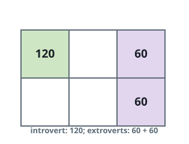

# Happiest Seating Chart

## Description

You are given four integers `m`, `n`, `introvertsCount`, and
`extrovertsCount`. A chart of `m x n` seats is available, together with a
pool of `introvertsCount` introverts and `extrovertsCount` extroverts to
seat in it.

Filling the chart is up to you — you are not required to seat everyone.
Each seat takes at most one person.

Every seated person's mood works out as follows:

- An introvert begins at 120 mood points and drops 30 points for every
  neighbor, whether introvert or extrovert.
- An extrovert begins at 40 mood points and gains 20 points for every
  neighbor, whether introvert or extrovert.

A neighbor is a person in a seat directly above, below, left of, or right
of one's own seat. The chart's score is the total mood of everyone
seated. Return the largest score any seating can earn.

### Example 1



```text
Input: m = 2, n = 3, introvertsCount = 1, extrovertsCount = 2
Output: 240
Explanation: Using 1-indexed (row, column) seats, seat the introvert at
(1,1) and the two extroverts at (1,3) and (2,3).
- Introvert at (1,1): 120 - (0 * 30) = 120, no neighbors.
- Extrovert at (1,3): 40 + (1 * 20) = 60, one neighbor.
- Extrovert at (2,3): 40 + (1 * 20) = 60, one neighbor.
The chart scores 120 + 60 + 60 = 240.
```

### Example 2

```text
Input: m = 1, n = 4, introvertsCount = 2, extrovertsCount = 1
Output: 270
Explanation: In the single row, seat an introvert at column 1, the
extrovert at column 2, and the other introvert at column 4.
- Introvert at column 1: 120 - 30 = 90, next to the extrovert.
- Extrovert at column 2: 40 + 20 = 60, one neighbor.
- Introvert at column 4: 120, nothing beside it.
The chart scores 90 + 60 + 120 = 270.
```

### Example 3

```text
Input: m = 2, n = 2, introvertsCount = 2, extrovertsCount = 2
Output: 280
Explanation: Put the two introverts on one diagonal and the two
extroverts on the other.
- Each introvert: 120 - (2 * 30) = 60, two neighbors each.
- Each extrovert: 40 + (2 * 20) = 80, two neighbors each.
The chart scores 60 + 60 + 80 + 80 = 280.
```

### Example 4

```text
Input: m = 1, n = 1, introvertsCount = 1, extrovertsCount = 1
Output: 120
Explanation: A one-seat chart can hold just one person, so the better
deal is the introvert's 120 rather than the extrovert's 40.
```

### Constraints

- `1 <= m, n <= 5`
- `0 <= introvertsCount, extrovertsCount <= min(m * n, 6)`

## Hints

### Hint 1

Every seat admits exactly three choices: leave it empty, seat an
introvert, or seat an extrovert.

### Hint 2

A dynamic program can sweep the seats in row-major order; its state only
needs the occupancy of the seats a newcomer can still touch, the counts
of each kind still unseated, and the current position.

### Hint 3

Pack the recent occupancy into one base-3 number whose least significant
digit is the most recently filled seat, and fold the seats already
visited in the current row into that same window — then each new
placement settles all of its neighbor bonds at once.
