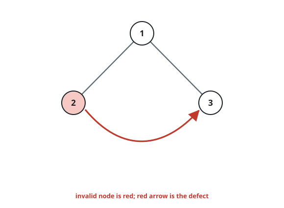
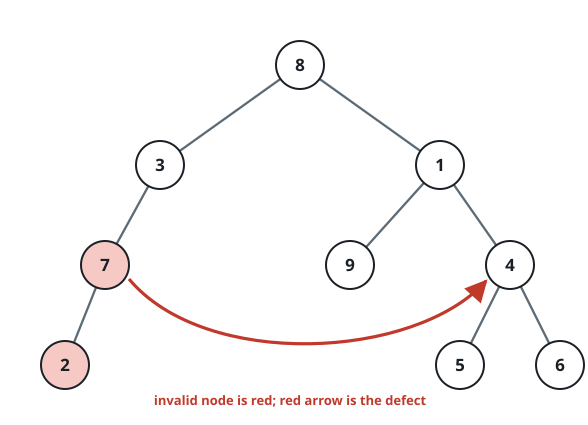

# Prune the Defective Node

## Description

A binary tree comes to you whole, together with two of its values,
`fromNode` and `toNode`. Your method receives the clean tree plus both
values, and the contract hands it one act of sabotage to commit first:
aim the `fromNode` node's right slot — empty in the tree as supplied — at
the `toNode` node.

That wire turns `fromNode` into the tree's single invalid node. The two
nodes sit at the same depth with `toNode` somewhere to the right, so
`fromNode` ends up with a right child that is not really its child at all
but a stranger snatched from its own level. Return the root of the
repaired tree: delete the invalid node and everything hanging below it,
while the `toNode` node survives untouched, since it never truly belonged
to `fromNode`.

### Example 1



```text
Input: root = [1,2,3], fromNode = 2, toNode = 3
Output: [1,null,3]
Explanation: Node 2 was wired to node 3, so node 2 is the invalid one.
Deleting it leaves the root holding node 3 as its only survivor on the
right.
```

### Example 2



```text
Input: root = [8,3,1,7,null,9,4,2,null,null,null,5,6], fromNode = 7, toNode = 4
Output: [8,3,1,null,null,9,4,null,null,5,6]
Explanation: Node 7 was wired to node 4, so node 7 is the invalid one.
Removing it takes its only child, node 2, down with it, while node 4
stays right where it was.
```

### Constraints

- The tree holds between `3` and `10⁴` nodes.
- Every node value lies in the range `[-10⁹, 10⁹]`, and all values are
  distinct.
- `fromNode` and `toNode` are distinct values that both occur in the
  tree, on the same depth.
- `toNode` lies strictly to the right of `fromNode` on that depth.
- In the tree as supplied, the `fromNode` node has no right child.

## Hints

### Hint 1

Sweep the tree in an order that reaches the right side of every level
first. The wired edge then betrays itself: it is the one right child that
points at a node the sweep has already visited.
