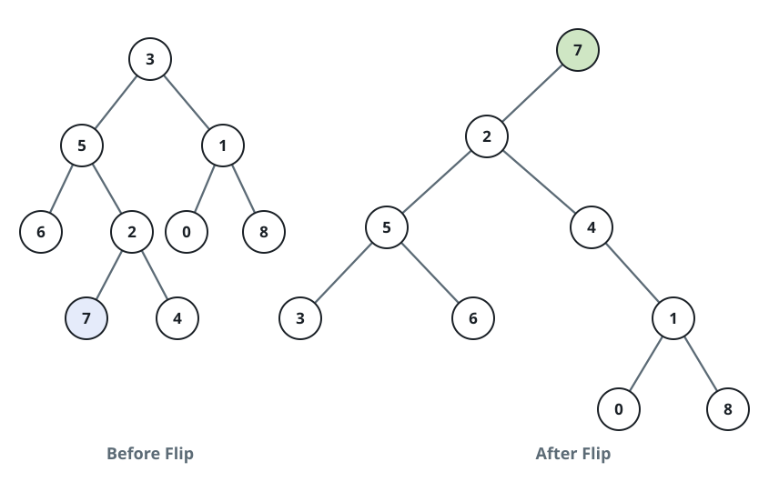

# Reroot the Tree at a Leaf

## Description

You are given the `root` of a binary tree and one of its leaves, identified
by value. Re-hang the whole tree from that leaf so the leaf becomes the new
root, following this rule for every node `cur` on the path that climbs from
the leaf to the old root (the old root itself excluded):

1. If `cur` has a left child, that child moves across and becomes `cur`'s
   right child.
2. `cur`'s former parent is attached as `cur`'s left child. Detaching the
   parent from `cur` first leaves the parent with at most one child, so the
   moved subtree always has a free slot to land in.

Return the new root.

One wire note: trees cross this judge's interface top-down, as a
level-order array, and there are no per-node parent pointers on the wire —
the leaf arrives as its integer value, which is unique within the tree. The
rerooting rule is applied unchanged; whatever parent tracking the climb
needs is the solver's own bookkeeping, and the rerooted tree is judged by
its level-order array alone.

### Example 1



```text
Input: root = [3,5,1,6,2,0,8,null,null,7,4], leaf = 7
Output: [7,2,null,5,4,3,6,null,null,null,1,null,null,0,8]
Explanation: Climbing up from the leaf visits 7, then 2, then 5, then 3.
Node 2 is hung below 7; node 5 below 2, with 4 kept as 2's right child;
node 3 below 5, whose left child 6 swings across to the right; and 1,
still holding 0 and 8, ends up below 3.
```

### Example 2

```text
Input: root = [4,2,9,1,3,7], leaf = 7
Output: [7,9,null,4,null,2,null,1,3]
Explanation: The climb from the leaf runs 7 -> 9 -> 4. Node 9 is hung
below 7, then node 4 below 9; the subtree rooted at 2 (leaves 1 and 3)
stays where it is as 4's left child.
```

### Example 3

```text
Input: root = [5,3,8,1], leaf = 1
Output: [1,3,null,5,null,null,8]
Explanation: The climb from the leaf runs 1 -> 3 -> 5. Node 3 is hung
below 1, then node 5 below 3; node 5's right child 8 stays in place.
```

### Constraints

- The tree holds between 2 and 100 nodes.
- Every node value lies between -10⁹ and 10⁹.
- All node values are distinct.
- `leaf` is guaranteed to be a value in the tree.

## Hints

### Hint 1

Scan the tree once to record every node's parent, then climb from the
leaf upward until you are standing on the old root.

### Hint 2

Each climb step severs the current node's link from its parent, swings a
surviving left child across to the right side, and hangs the parent as
the new left child.
