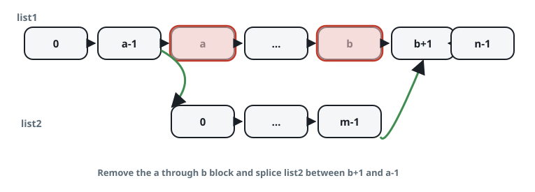
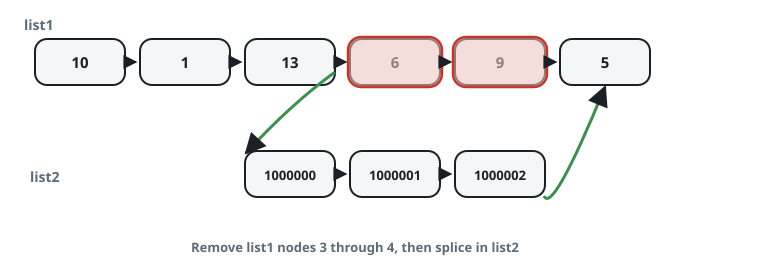
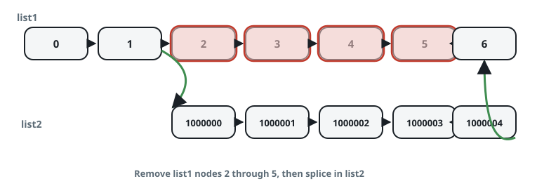

# Splice One List Into Another

## Description

You are handed two linked lists: `list1`, which holds `n` nodes, and
`list2`, which holds `m`. Cut the stretch of `list1` that runs from
position `a` through position `b` (positions counted from 0) out of the
list, and link all of `list2` into the gap in its original order.

Return the head of the assembled list.



### Example 1



```text
Input: list1 = [10,1,13,6,9,5], a = 3, b = 4, list2 = [1000000,1000001,1000002]
Output: [10,1,13,1000000,1000001,1000002,5]
Explanation: The nodes at positions 3 and 4 are cut out, and every node
of list2 is linked where they sat, with the nodes in front of and behind
the cut kept as they were.
```

### Example 2



```text
Input: list1 = [0,1,2,3,4,5,6], a = 2, b = 5, list2 = [1000000,1000001,1000002,1000003,1000004]
Output: [0,1,1000000,1000001,1000002,1000003,1000004,6]
Explanation: The stretch from position 2 through position 5 is replaced
by all of list2; the first two nodes of list1 and its final node remain.
```

### Example 3

```text
Input: list1 = [7,8,9,10,11,12], a = 2, b = 3, list2 = [50,60]
Output: [7,8,50,60,11,12]
Explanation: Positions 2 and 3 are cut out and the two nodes of list2
take their place between 8 and 11.
```

### Constraints

- `list1` holds between 3 and 10⁴ nodes.
- `1 <= a <= b < list1.length - 1` — the cut never touches list1's first
  or last node.
- `list2` holds between 1 and 10⁴ nodes.

## Hints

### Hint 1

The splice changes only two links; figure out which pair.

### Hint 2

One of them belongs to the node just before position `a`: point its
`next` at the first node of `list2`.

### Hint 3

The other belongs to the last node of `list2`: point its `next` at the
node just after position `b`.
