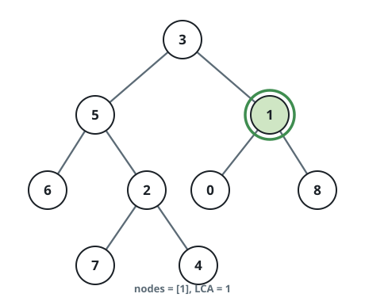

# Nearest Shared Ancestor of a Binary Tree IV

## Description

You are given the `root` of a binary tree and a list of values `nodes`,
each naming a distinct node that exists in the tree. Return the value of
the nearest shared ancestor of all the listed nodes: the deepest node
that has every one of them as a descendant, where a node counts as a
descendant of itself. Node values are unique, so a value pins down
exactly one node.

The tree crosses the wire as a level-order array and the answer is the
ancestor node's value, so targets are named by value throughout.

### Example 1


```text
Input: root = [3,5,1,6,2,0,8,null,null,7,4], nodes = [4,7]
Output: 2
Explanation: Values 4 and 7 sit in different subtrees of the node
valued 2, so 2 is the deepest node spanning both.
```

### Example 2



```text
Input: root = [3,5,1,6,2,0,8,null,null,7,4], nodes = [1]
Output: 1
Explanation: A single target is its own nearest shared ancestor.
```

### Example 3


```text
Input: root = [3,5,1,6,2,0,8,null,null,7,4], nodes = [7,6,2,4]
Output: 5
Explanation: The deepest node having 7, 6, 2, and 4 as descendants is
the node valued 5.
```

### Constraints

- The tree holds between `1` and `10⁴` nodes.
- `-10⁹ <= Node.val <= 10⁹`
- Every node in the tree carries a distinct value.
- Every value in `nodes` occurs in the tree, and no value repeats.

## Hints

### Hint 1

Search the left and the right subtree of each node for the listed
values.

### Hint 2

When one subtree holds none of the targets, the answer must come from
the other subtree's result.

### Hint 3

When the targets split across both subtrees, the current node is the
answer.
