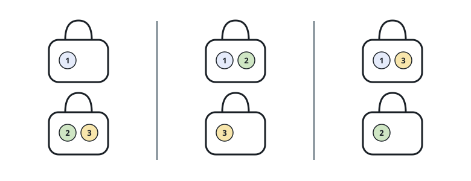

# Ways to Fill Goodie Bags

## Description

A party table holds `n` distinct candies, numbered `1` through `n`, next to
`k` empty goodie bags. Every candy must go into one of the bags, and when the
packing is done no bag may be empty.

Two packings count as the same filling when each bag of the first packing has
its candies gathered in a single bag of the second — and vice versa. It never
matters which physical bag is which, nor the order of candies written inside
one bag: a bag holding candies `2` and `3` reads the same as `(2,3)` or
`(3,2)`. But pulling candies `2` and `3` apart into separate bags yields a
different filling, even when every other candy sits in the same company as
before.

Return how many distinct fillings there are, modulo `10⁹ + 7`.

### Example 1



```text
Input: n = 3, k = 2
Output: 3
Explanation: Three candies split over two bags give exactly these fillings:
(1), (2,3)
(1,2), (3)
(1,3), (2)
```

### Example 2

```text
Input: n = 4, k = 3
Output: 6
Explanation: Three bags for four candies force exactly one shared bag, so the
filling is decided by which pair shares it: (1,2), (3), (4) up through
(3,4), (1), (2) — six choices in all.
```

### Example 3

```text
Input: n = 25, k = 6
Output: 740817518
Explanation: Candies 1 through 25 spread over six bags can be packed in
37026417000002430 ways, and 37026417000002430 mod 10⁹ + 7 = 740817518.
```

### Constraints

- `1 <= k <= n <= 1000`

## Hints

### Hint 1

Build the answer one candy at a time. Keep a table entry that counts the
fillings of the first `i` candies across exactly `j` nonempty bags, and ask
what the `i`th candy adds.

### Hint 2

Consider the bag that takes candy `i`. If that bag already holds an earlier
candy, erasing candy `i` leaves an arbitrary filling of `i - 1` candies into
the same `j` bags, and candy `i` had `j` bags to pick from — so this case
contributes `j` times the `(i - 1, j)` entry.

### Hint 3

Otherwise candy `i` opens a bag of its own. Removing that lone bag leaves a
filling of `i - 1` candies into `j - 1` bags, with nothing to choose, so this
case contributes the `(i - 1, j - 1)` entry.

### Hint 4

Sum the two cases, reduce modulo `10⁹ + 7`, and fill the table row by row —
only the previous row stays live, so two arrays over `j` suffice.
