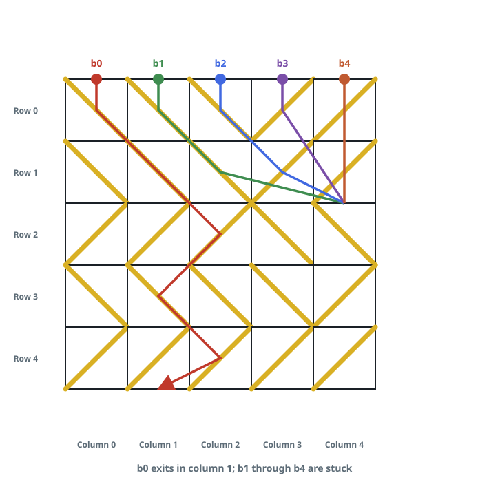

# Ball Exit Columns

## Description

You are given an `m x n` grid representing the cross-section of a box that
is open along its top and bottom edges, together with `n` balls — one
dropped from the top of each column.

Every cell holds a diagonal board that catches a ball and sends it toward
one side of the cell:

- A board tilted from the cell's top-left corner down to its bottom-right
  corner sends a ball to the right and is stored as `1`.
- A board tilted from the top-right corner down to the bottom-left corner
  sends a ball to the left and is stored as `-1`.

Each ball tumbles downward row by row. It either clears the bottom of the
box or jams inside. Jamming happens in exactly two situations: two
neighbouring boards tilt toward each other and trap the ball in the
channel between them — a `"V"` shape — or a board steers the ball into the
left or right wall of the box.

Return an array `answer` of length `n`, where `answer[i]` is the column at
which the ball dropped from column `i` leaves the bottom of the box, or
`-1` if that ball jams inside.

### Example 1



```text
Input: grid = [[1,1,1,-1,-1],[1,1,1,-1,-1],[-1,-1,-1,1,1],[1,1,1,1,-1],[-1,-1,-1,-1,-1]]
Output: [1,-1,-1,-1,-1]
Explanation: Ball b0 is routed rightward all the way down and exits at
column 1.
Ball b1 jams in the channel between columns 2 and 3 in row 1.
Ball b2 jams in the channel between columns 2 and 3 in row 0.
Ball b3 jams against that same row-0 channel.
Ball b4 jams in the channel between columns 2 and 3 in row 1.
```

### Example 2

```text
Input: grid = [[1,1]]
Output: [1,-1]
Explanation: The left ball is carried right into the neighbouring column
and out of the bottom. The right ball is steered into the right wall and
jams.
```

### Example 3

```text
Input: grid = [[1,1,-1,1,1],[-1,1,1,-1,-1],[1,-1,1,1,1]]
Output: [3,-1,-1,4,-1]
Explanation: Ball 0 funnels right through every row and leaves at column
3. Ball 1 jams in the V between columns 1 and 2 at row 0; ball 2 jams
against that same V from the other side. Ball 3 zigzags down and leaves at
column 4. Ball 4 is pushed into the right wall.
```

### Constraints

- `m == grid.length`
- `n == grid[i].length`
- `1 <= m, n <= 100`
- `grid[i][j]` is `1` or `-1`.

## Hints

### Hint 1

Handle the balls one at a time and walk each down the rows with a plain
loop — no recursion is needed.

### Hint 2

A ball over column `c` whose board reads `d` is aimed at the channel
between columns `c` and `c + d`; it slips through only when the board on
the far side of that channel tilts the same way.

### Hint 3

The channel is sealed when the far board tilts the opposite way — the
`"V"` — or when `c + d` falls outside the grid, which is the wall.
