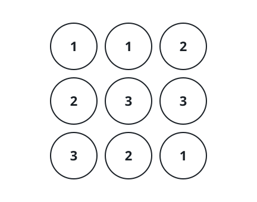

# Counting Ancestor Trees

## Description

You receive a list `pairs` of number pairs, where `pairs[i] = [x_i, y_i]`;
every pair is distinct and every one satisfies `x_i < y_i`.

Consider rooted trees built on exactly the values that occur in `pairs`,
where a pair `[x_i, y_i]` appears in the list precisely when one of its two
values is an ancestor of the other (a node is never its own ancestor, and
the root has no ancestors; the tree need not be binary). Two such trees
count as different constructions as soon as some node has a different
parent in them.

Classify how many trees fit the list:

- `0` if none do
- `1` if exactly one does
- `2` if more than one does

### Example 1


```text
Input: pairs = [[1,2],[2,3]]
Output: 1
Explanation: Only one rooted tree works: 2 at the root, with 1 and 3
hanging directly beneath it.
```

### Example 2



```text
Input: pairs = [[1,2],[2,3],[1,3]]
Output: 2
Explanation: Every node relates to every other, so any of the three can
take the root and chain the other two below it — several distinct trees.
```

### Example 3

```text
Input: pairs = [[1,2],[3,4]]
Output: 0
Explanation: Values 1 and 3 (and likewise 2 and 4) never appear together
in a pair, yet two nodes of one tree are always ancestor-related. No
tree exists.
```

### Constraints

- `1 <= pairs.length <= 10⁵`
- `1 <= x_i < y_i <= 500`
- All the pairs are different.

## Hints

### Hint 1

Start from the root. A root is ancestor-related to every other node, so it
must be paired with all of them — and if no value is paired with all the
others, the answer is `0`.

### Hint 2

Order nodes by how many pairs they appear in. A node's pair count can
never exceed its parent's.

### Hint 3

When a node's pair count exactly equals its parent's, the two can trade
places, so uniqueness is gone.

### Hint 4

Work down the degree order: the heaviest-paired remaining node is the root
of its group and has no parent there; the rest of the group follows
recursively.
