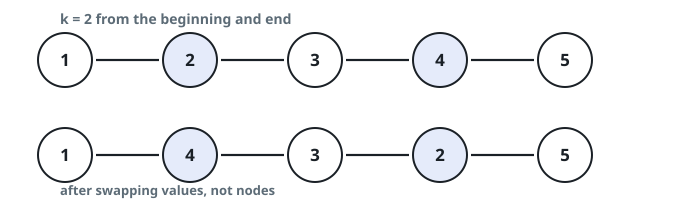

# Mirrored List Swap

## Description

You hold the `head` of a singly linked list and an integer `k`. Reading the
list with 1-based positions, trade the value stored in the node `k` places
from the front for the value stored in the node `k` places from the back,
then hand back the list.

Nothing but values moves: no node is created or dropped, every link stays
exactly as it was, and the list keeps its length.

### Example 1



```text
Input: head = [1,2,3,4,5], k = 2
Output: [1,4,3,2,5]
Explanation:
Two nodes in from each end sit the ones carrying 2 and 4; after the value
trade the list reads [1,4,3,2,5].
```

### Example 2

```text
Input: head = [9,1,4,7,6,3], k = 3
Output: [9,1,7,4,6,3]
Explanation:
The 3rd node from the front carries 4 while the 3rd node from the back
carries 7; trading those values leaves [9,1,7,4,6,3].
```

### Constraints

- The list contains `n` nodes.
- `1 <= k <= n <= 10⁵`
- `0 <= Node.val <= 100`

## Hints

### Hint 1

The two targets are mirror images: whatever sits `k` steps from the tail
sits `n - k + 1` steps from the head, so locating one locates both
positions.

### Hint 2

Advance a cursor `k - 1` steps to stand on the front target, then send a
scout from there to the tail with a second cursor trailing from the head;
the trailing cursor lands on the back target the moment the scout lands on
the tail.

### Hint 3

Since only values trade places, the whole job ends with one two-sided
assignment of the `.val` fields — no `next` pointer is rewritten.
