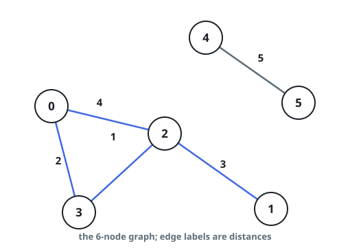

# Paths Under A Distance Cap

## Description

An undirected graph of `n` nodes is defined by `edgeList`, where
`edgeList[i] = [ui, vi, disi]` denotes an edge between nodes `ui` and
`vi` with distance `disi`. There may be multiple edges between two nodes,
and the graph may not be connected.

Implement the `CappedPaths` class:

- `CappedPaths(int n, int[][] edgeList)` initializes the structure with
  the graph.
- `boolean query(int p, int q, int limit)` returns `true` if there
  exists a path from `p` to `q` such that every edge on the path has a
  distance strictly less than `limit`, and `false` otherwise.

### Example 1



```text
Input:
["CappedPaths", "query", "query", "query", "query"]
[[6, [[0, 2, 4], [0, 3, 2], [1, 2, 3], [2, 3, 1], [4, 5, 5]]], [2, 3, 2], [1, 3, 3], [2, 0, 3], [0, 5, 6]]
Output: [null, true, false, true, false]
Explanation:
CappedPaths cappedPaths = new CappedPaths(6, [[0, 2, 4], [0, 3, 2], [1, 2, 3], [2, 3, 1], [4, 5, 5]]);
cappedPaths.query(2, 3, 2); // return true. The edge between 2 and 3 has distance 1, which is less than 2.
cappedPaths.query(1, 3, 3); // return false. There is no way to go from 1 to 3 using only distances strictly less than 3.
cappedPaths.query(2, 0, 3); // return true. Travel from 2 to 3 to 0 — every edge on that walk is under 3.
cappedPaths.query(0, 5, 6); // return false. Nodes 0 and 5 are in different components.
```

### Constraints

- `2 <= n <= 10⁴`
- `0 <= edgeList.length <= 10⁴`
- `edgeList[i].length == 3`
- `0 <= ui, vi, p, q <= n - 1`
- `ui != vi`
- `p != q`
- `1 <= disi, limit <= 10⁹`
- At most `10⁴` calls are made to `query`.

## Hints

### Hint 1

A path exists under `limit` exactly when both endpoints land in the same
component of the graph keeping only edges under `limit`.

### Hint 2

Process queries grouped by ascending `limit` and grow the graph with a
union-find; or precompute a minimum spanning tree and answer each query
from the maximum edge on the tree path between the endpoints.
