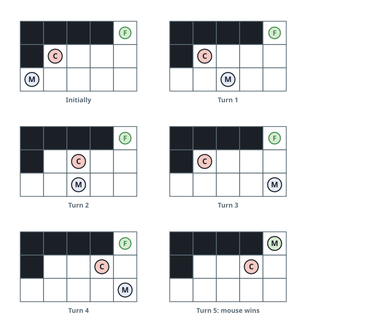
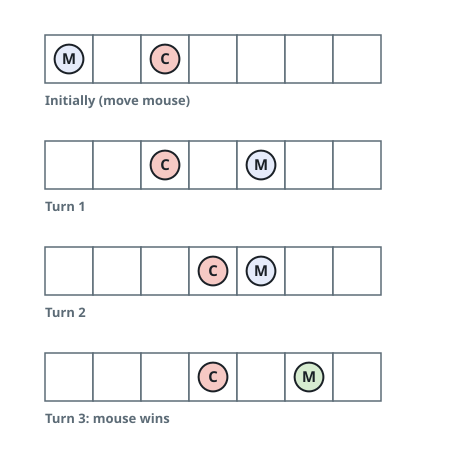

# Mouse Outruns the Cat II

## Description

Cat and Mouse — two players with exactly those names — play a game on a
grid of `rows x cols` cells. Every cell of the grid is one of four things:

- The two players appear as the characters `'C'` (Cat) and `'M'` (Mouse).
- `'.'` marks open floor, which either player may enter.
- `'#'` marks a wall, which neither player may enter or cross.
- `'F'` marks the food, which either player may enter.

Exactly one `'C'`, one `'M'`, and one `'F'` appear in `grid`.

The rules of play:

- Mouse moves first, and from then on the two alternate turns.
- On its turn a player slides in one of the four directions (up, down,
  left, right) by any distance from 1 up to its jump limit — `mouseJump`
  for Mouse, `catJump` for Cat. A slide may not run into or across a wall,
  and may not leave the grid.
- A player may also stay on its current cell instead of sliding.
- Mouse is allowed to slide straight over the Cat's cell.

The game ends in one of four ways:

- Cat stands on the same cell as Mouse: Cat wins.
- Cat reaches the food first: Cat wins.
- Mouse reaches the food first: Mouse wins.
- Mouse has not reached the food within 1000 turns: Cat wins.

Given the `rows x cols` grid and the two jump limits `catJump` and
`mouseJump`, decide whether Mouse wins when both sides play optimally.

### Example 1



```text
Input: grid = ["####F","#C...","M...."], catJump = 1, mouseJump = 2
Output: true
Explanation: With its longer slides Mouse always keeps its distance; Cat
can neither corner it nor beat it to the food.
```

### Example 2



```text
Input: grid = ["M.C...F"], catJump = 1, mouseJump = 4
Output: true
```

### Example 3

```text
Input: grid = ["M..C.F"], catJump = 1, mouseJump = 1
Output: false
Explanation: With single-cell hops on both sides, Cat plants itself between
Mouse and the food and mirrors every move; Mouse never slips past and never
arrives first.
```

### Constraints

- `rows == grid.length`
- `cols == grid[i].length`
- `1 <= rows, cols <= 8`
- Every character of `grid[i][j]` is one of `'C'`, `'M'`, `'F'`, `'.'`,
  and `'#'`.
- `'C'`, `'M'`, and `'F'` each appear exactly once in `grid`.
- `1 <= catJump, mouseJump <= 8`

## Hints

### Hint 1

Think of a position as just three facts — Mouse's cell, Cat's cell, and
whose turn it is — and start from the positions whose winner is already
decided by the rules.

### Hint 2

Spread those known verdicts backward: a position is won by its mover if any
move reaches a position that mover wins, and lost by its mover once every
move has been proven to reach a winning position for the opponent.

### Hint 3

Positions still unlabelled after the sweep are the endless chases where
nobody eats — the 1000-turn rule awards exactly those to Cat.
