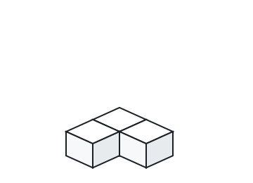

# Boxes Piled into a Corner

## Description

A square storeroom measures `n` units along its width, its length, and
its height, and `n` unit cubes must be stored inside it. Two rules
govern how the cubes may be arranged:

- A cube may rest anywhere on the floor.
- Whenever one cube `x` sits on top of another cube `y`, all four
  vertical faces of `y` must be flush — each one either pressed against
  a wall of the room or against another cube.

Given `n`, work out the smallest number of cubes that end up resting on
the floor.

### Example 1



```text
Input: n = 3
Output: 3
Explanation: With only two floor cubes, a third can never go on top —
even tucked into a corner, a floor cube keeps two vertical faces
exposed — so all three cubes must sit on the floor.
```

### Example 2


```text
Input: n = 4
Output: 3
Explanation: Three floor cubes form an L against the corner, and the
fourth cube rests on the corner cube, whose four vertical faces now
each meet a wall or a cube.
```

### Example 3


```text
Input: n = 10
Output: 6
Explanation: A triangular corner footprint of 3, 2 and 1 floor cubes
carries the six remaining cubes stacked above it.
```

### Constraints

- `1 <= n <= 10⁹`

## Hints

### Hint 1

If `m` cubes are allowed on the floor, what is the largest number of
cubes the room can hold under the best arrangement?

### Hint 2

The first cube belongs in the corner, where walls already cover two of
its faces.
