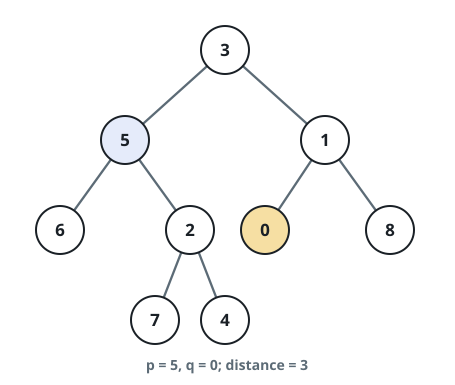
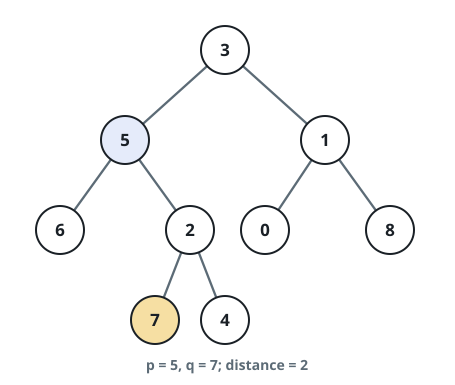
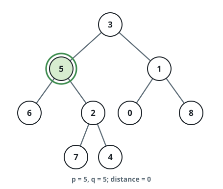

# Edges Between Two Tree Values

## Description

A binary tree is given through its `root`, together with two values `p`
and `q` that each belong to some node of the tree (all node values are
distinct). Measure how far apart the two values sit: the measure is the
number of edges along the unique path joining the node holding `p` to
the node holding `q`.

### Example 1



```text
Input: root = [3,5,1,6,2,0,8,null,null,7,4], p = 5, q = 0
Output: 3
Explanation: The path 5-3-1-0 uses 3 edges.
```

### Example 2



```text
Input: root = [3,5,1,6,2,0,8,null,null,7,4], p = 5, q = 7
Output: 2
Explanation: The path 5-2-7 uses 2 edges.
```

### Example 3



```text
Input: root = [3,5,1,6,2,0,8,null,null,7,4], p = 5, q = 5
Output: 0
Explanation: A value and itself are 0 edges apart.
```

### Constraints

- The tree holds between `1` and `10⁴` nodes.
- Every node value lies in `[0, 10⁹]`.
- All node values are distinct.
- `p` and `q` are guaranteed to be values present in the tree.

## Hints

### Hint 1

Locate the lowest common ancestor of the two nodes carrying `p` and
`q`.

### Hint 2

The answer splits into two legs: from `p` up to that ancestor, then
from the ancestor down to `q`.
