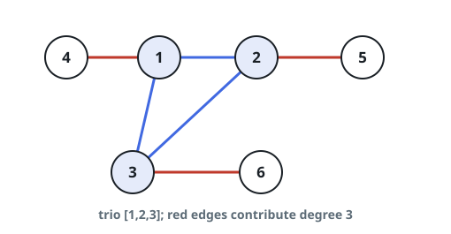
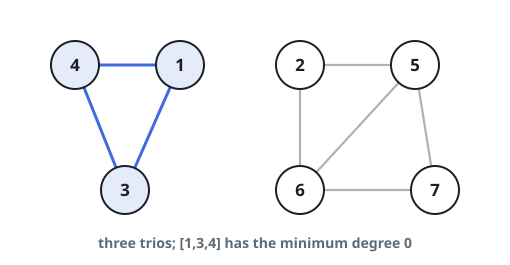

# Lightest Connected Trio

## Description

An undirected graph has `n` nodes numbered `1` through `n`, plus an
array `edges` where each `edges[i] = [ui, vi]` joins nodes `ui` and
`vi`.

A connected trio is a set of three nodes with an edge joining every
pair of them. Its degree is the number of edges with exactly one
endpoint inside the trio. Report the smallest degree any connected trio
of the graph has, or `-1` when the graph contains no trio at all.

### Example 1



```text
Input: n = 6, edges = [[1,2],[1,3],[3,2],[4,1],[5,2],[3,6]]
Output: 3
Explanation: The only trio is [1,2,3]. The three edges leaving it —
[4,1], [5,2], and [3,6], bolded in the figure — give it degree 3.
```

### Example 2



```text
Input: n = 7, edges = [[1,3],[4,1],[4,3],[2,5],[5,6],[6,7],[7,5],[2,6]]
Output: 0
Explanation: Three trios exist: [1,4,3] has no edges leaving it, while
[2,5,6] and [5,6,7] each have two, so the answer is 0.
```

### Example 3

```text
Input: n = 4, edges = [[1,2],[2,3],[3,4]]
Output: -1
Explanation: The graph is a single path; no three nodes are mutually
adjacent, so no connected trio exists.
```

### Constraints

- `2 <= n <= 400`
- `1 <= edges.length <= n * (n - 1) / 2`
- Each `edges[i]` holds exactly two endpoints `ui` and `vi` with
  `1 <= ui, vi <= n` and `ui != vi`.
- No edge appears more than once.

## Hints

### Hint 1

For a trio of nodes `u`, `v`, `w`, add the three vertex degrees and
subtract 6: each internal edge was tallied twice, once at each of its
ends, so `degree(u) + degree(v) + degree(w) - 6` is exactly the trio's
degree.

### Hint 2

Walk the edges rather than all node triples. For each edge `(u, v)`,
every common neighbor completes a trio, and the best trio through that
edge pairs it with the common neighbor of smallest degree.
