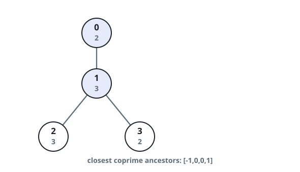
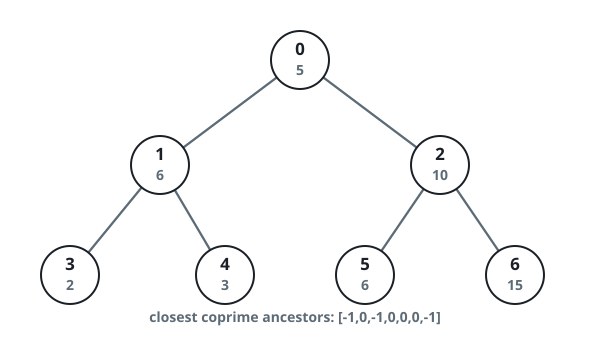

# Nearest Coprime Ancestor

## Description

A tree of `n` nodes numbered `0` to `n - 1` is given through exactly
`n - 1` edges, rooted at node `0`. Every node carries a value: you are
given an array `nums` where `nums[i]` is node `i`'s value, and an array
`edges` where each `edges[j] = [uj, vj]` is an edge joining nodes `uj`
and `vj`.

Two values `x` and `y` are coprime when their greatest common divisor
is 1, `gcd(x, y) == 1`.

An ancestor of node `i` is any node other than `i` itself lying on the
path from `i` up to the root.

Build an array `ans` of length `n` where `ans[i]` is the ancestor of
node `i` nearest to it whose value is coprime with `nums[i]`, or `-1`
when no ancestor qualifies.

### Example 1



```text
Input: nums = [2,3,3,2], edges = [[0,1],[1,2],[1,3]]
Output: [-1,0,0,1]
Explanation:
- Node 0 sits at the root, so it has no ancestors.
- Node 1's single ancestor is node 0, and gcd(3,2) == 1 — a match.
- Node 2's ancestors are node 1 (value 3, gcd(3,3) == 3 — no) and then
  node 0 (value 2, gcd(2,3) == 1 — yes), so node 0 answers.
- Node 3's nearest ancestor, node 1, already satisfies gcd(3,2) == 1,
  so node 1 answers.
```

### Example 2



```text
Input: nums = [5,6,10,2,3,6,15], edges = [[0,1],[0,2],[1,3],[1,4],[2,5],[2,6]]
Output: [-1,0,-1,0,0,0,-1]
```

### Constraints

- `nums.length == n`
- `1 <= nums[i] <= 50`
- `1 <= n <= 10^5`
- `edges.length == n - 1`
- `edges[j].length == 2`
- `0 <= uj, vj < n`
- `uj != vj`

## Hints

### Hint 1

Among the ancestors that share one value, only the deepest one can
ever be an answer — every older node with that same value sits strictly
farther up the tree.

### Hint 2

Values never exceed 50, so a node can find its answer by checking the
50 possible ancestor values instead of walking up its ancestor chain.
