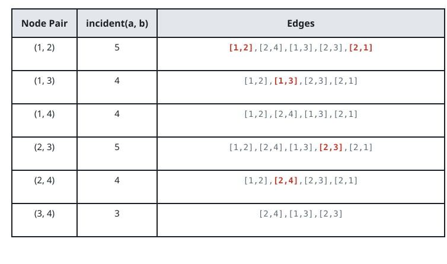

# Counting Well-Connected Pairs

## Description

An undirected graph has `n` nodes numbered `1` through `n` and an edge list
`edges`, where `edges[i] = [ui, vi]` joins nodes `ui` and `vi`. The same two
nodes may be joined by several parallel edges.

For two nodes `a` and `b`, define `incident(a, b)` as the number of edges
that touch `a` or `b`. An edge joining `a` and `b` themselves touches both
endpoints yet still counts once, and every unordered pair of distinct nodes
has an `incident` value, whether or not an edge directly joins them and
whether or not they share a neighbor.

The answer to query `queries[j]` is the number of node pairs `(a, b)` with
`a < b` whose `incident(a, b)` is strictly greater than `queries[j]`.
Return an array of these answers, one per query.

### Example 1



```text
Input: n = 4, edges = [[1,2],[2,4],[1,3],[2,3],[2,1]], queries = [2,3]
Output: [6,5]
Explanation: Every one of the six node pairs has an incident(a, b) value
above 2, and every pair except (3, 4) also exceeds 3.
```

### Example 2

```text
Input: n = 4, edges = [[1,2],[1,2],[3,4]], queries = [1,2,3]
Output: [5,4,0]
Explanation: The doubled edge makes incident(1, 2) equal 2 — parallel edges
each count — while incident(3, 4) is 1. Five pairs exceed 1, the four pairs
with value 3 exceed 2, and nothing exceeds 3.
```

### Example 3

```text
Input: n = 5, edges = [[1,2],[2,3],[3,4],[4,5]], queries = [1,2,3]
Output: [10,7,1]
Explanation: Every pair here has an incident value of at least 2, so all
ten pairs exceed 1 and seven exceed 2; only incident(2, 4) reaches 4.
```

### Constraints

- `2 <= n <= 2 * 10⁴`
- `1 <= edges.length <= 10⁵`
- `1 <= ui, vi <= n`
- `ui != vi`
- `1 <= queries.length <= 20`
- `0 <= queries[j] < edges.length`

## Hints

### Hint 1

An `incident` value can be assembled from cheaper pieces: it equals
`deg(a) + deg(b)` minus the number of edges that join `a` and `b` directly,
because those edges are carried by both degree terms.

### Hint 2

Pretend the subtraction is zero at first, and count pairs whose degree sum
beats `k` — sorting the degrees makes two pointers do it in one sweep.

### Hint 3

That sweep is wrong only for pairs joined by an edge. Count how many of
those have a degree sum above `k` while their true `incident` value is not,
and subtract them.
