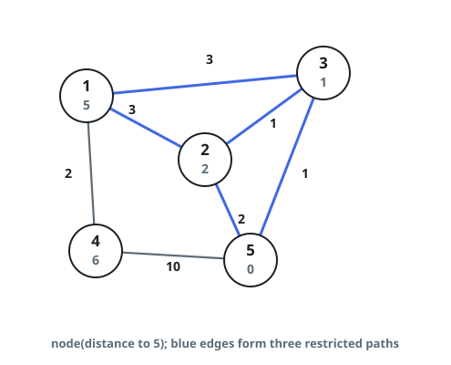
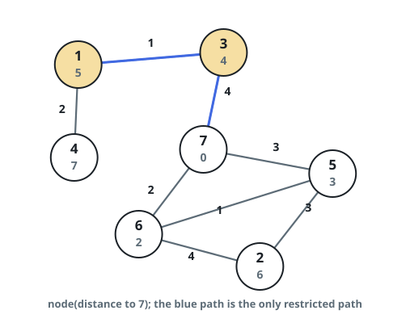

# Downhill Paths to the Last Node

## Description

You are given a connected undirected graph on `n` nodes numbered `1` through
`n`, described by the edge list `edges`, where `edges[i] = [ui, vi, wi]` joins
`ui` and `vi` and weighs `wi`.

For a node `x`, write `dist(x)` for the weight of the cheapest route from `x`
to node `n` (a route's weight is the total of its edge weights). A walk that
starts at node `1` and ends at node `n`, moving only along edges, is called
_downhill_ when every hop lands strictly closer to node `n` under this
measure — that is, if the walk visits `v0 = 1, v1, ..., vk = n`, then
`dist(vi) > dist(vi+1)` for every hop.

How many downhill walks lead from node `1` to node `n`? Report the count
modulo `10⁹ + 7`.

### Example 1



```text
Input: n = 5, edges = [[1,2,3],[1,3,3],[2,3,1],[1,4,2],[5,2,2],[3,5,1],[5,4,10]]
Output: 3
Explanation: Each circle is labeled with its shortest distance to node 5,
and the highlighted edges trace the three downhill paths:
1) 1 --> 2 --> 5
2) 1 --> 2 --> 3 --> 5
3) 1 --> 3 --> 5
```

### Example 2



```text
Input: n = 7, edges = [[1,3,1],[4,1,2],[7,3,4],[2,5,3],[5,6,1],[6,7,2],[7,5,3],[2,6,4]]
Output: 1
Explanation: Distances to node 7 are marked beside the nodes. Exactly one
walk, 1 --> 3 --> 7, moves strictly closer at every hop.
```

### Constraints

- `1 <= n <= 2 * 10⁴`
- `n - 1 <= edges.length <= 4 * 10⁴`
- `edges[i].length == 3`
- `1 <= ui, vi <= n`
- `ui != vi`
- `1 <= wi <= 10⁵`
- At most one edge joins any pair of nodes.
- Every pair of nodes is connected by some route.

## Hints

### Hint 1

One shortest-path pass rooted at node `n` prices every node's `dist` value.

### Hint 2

Orient each edge toward whichever endpoint sits closer to node `n`, and
discard the edges whose endpoints have equal distances.

### Hint 3

The surviving arrows can never form a cycle, so the task becomes counting
the node-`1`-to-node-`n` walks of a DAG — settle nodes in increasing
distance order and add up path counts.
