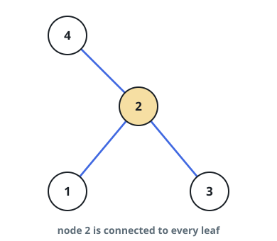

# The Hub of the Star Network

## Description

A star-shaped undirected graph has `n` nodes numbered `1` through `n`: one
distinguished node, the hub, is joined directly to each of the other `n - 1`
nodes, and no other connections exist.

The connection list `edges` is given, with `edges[i] = [ui, vi]` meaning
`ui` and `vi` are joined. Report the hub.

### Example 1



```text
Input: edges = [[1,2],[2,3],[4,2]]
Output: 2
Explanation: Node 2 touches every edge in the list, so it is the hub.
```

### Example 2

```text
Input: edges = [[7,3],[3,9],[12,3]]
Output: 3
```

### Constraints

- `3 <= n <= 10⁵`
- `edges.length == n - 1`
- `edges[i].length == 2`
- `1 <= ui, vi <= n`
- `ui != vi`
- The connections do form a star graph with a single hub.

## Hints

### Hint 1

Every node except the hub appears in exactly one edge.

### Hint 2

So the hub is the node any two edges share.
